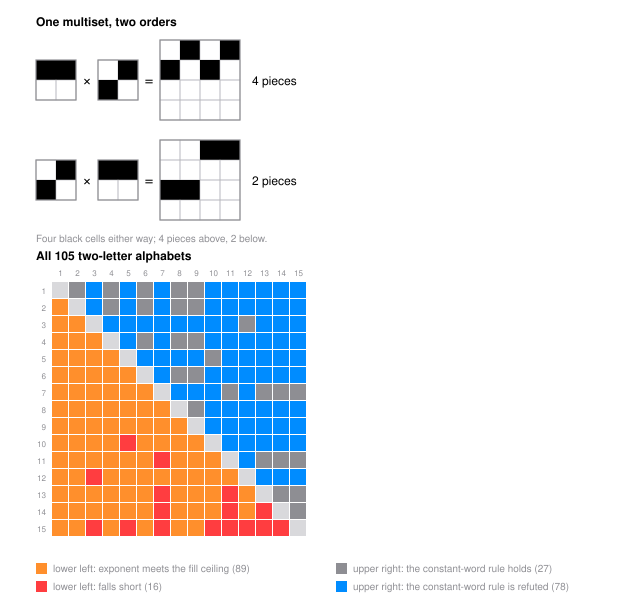

# The Component Exponent of a Two-Letter Kronecker Word

Nest one small black-and-white pattern inside another, then inside a third, and keep going forever, picking at each step one of two patterns according to an infinite word. Count the connected pieces after $L$ steps. The count depends on the order of the word, which is what the companion paper is about; this one asks whether the *growth rate* of the count does. It does not. We write down an exact formula for the piece count on every one of the $105$ two-letter alphabets over the fifteen nonempty two-by-two designs, and the rate falls out: whenever both letters occur with positive frequency it exists, sees nothing but the two frequencies, and on $89$ of the $105$ alphabets it is just the growth rate of the black-cell count, which never cared about the order in the first place. So the hoped-for payoff, an aperiodic word beating a periodic one, is not there, and the paper says so.

A *design* is a two-by-two square with some cells filled, coded $1$ to $15$. A word $w = (c_1, \dots, c_L)$ gives the $2^L \times 2^L$ picture $A_w = A_{c_1} \otimes \cdots \otimes A_{c_L}$, outermost factor first, with $\operatorname{fill}(A_w) = \prod_i k_{c_i}$ black cells and $\operatorname{comp}(A_w)$ four-connected pieces.

**Theorem.** Let $w$ be an infinite word over one of the $105$ alphabets whose letter frequencies exist and are strictly positive. Then $\chi(w) = \lim_L \tfrac1L \log \operatorname{comp}(A_{w_1 \cdots w_L})$ exists and depends only on the frequency vector, so it is blind to the order. It equals the fill exponent $f_a \log k_a + f_b \log k_b$ on $89$ of the alphabets and falls short on $16$; the constant-word rule $\Phi(f) = (f_6 + f_9)\log 2$ is refuted on $78$ and exact on $27$; and along the Thue-Morse word over any gasket-and-domino alphabet, $\chi = \tfrac12 \log 6$ exactly, with the two-sided certificate $\bigl|\log \operatorname{comp}(A_{w_1 \cdots w_L}) - \tfrac{L}{2}\log 6\bigr| \le \log 108 + \tfrac12 \log \tfrac32 < 4.885$ at every $L \ge 4$.

Five regimes close all $105$ alphabets and six geometric lemmas prove them: a contact-free letter cuts the word and turns the piece count into a prefix cell count ($69$ alphabets), two letters that never break apart give one piece ($12$), two dominoes at right angles give a power of two ($4$), a row-block argument handles a domino against the full tile ($4$), and a domino letter turns the count into a count of runs whose recursion telescopes ($16$). The positive-frequency hypothesis is load-bearing and the paper proves it sharp: at a boundary frequency three words with the same letter frequencies have rates $0$, $\log 2$, and no rate at all, the last one accumulating on a whole interval. `python3 scripts/verify.py` re-checks every number in about fifteen seconds: the closed forms against an independently drawn picture on all $26{,}670$ words of length at most $7$ over all $105$ alphabets, the four verdict counts re-derived alphabet by alphabet, the Thue-Morse certificate at every length up to $2^{14}$ in both readings, and the boundary and tripling words that mark the limits of the theorem.

- [paper.pdf](paper.pdf) - the paper.
- `tectonic paper.tex` rebuilds it; `python3 scripts/verify.py` re-checks every number; `python3 scripts/figure.py` redraws both plates.
