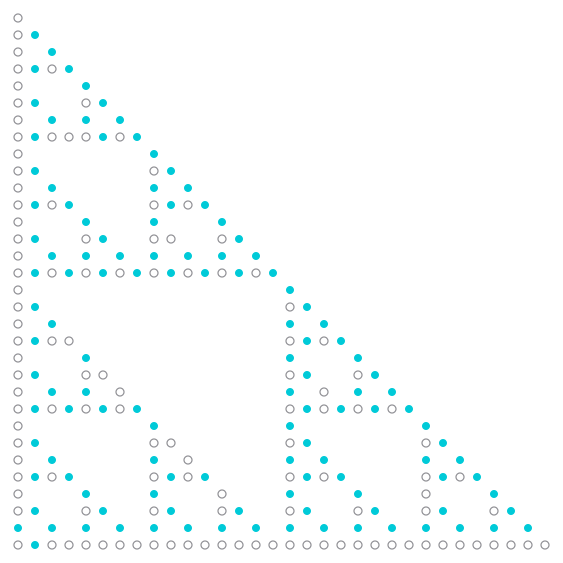

# Coprimality Density Above Dimension One

Stand at the origin of a square grid and look out: you can see a lattice point exactly when its coordinates share no common factor, and $6/\pi^2$ of all lattice points are visible. Now do the same on a fractal - the Sierpinski gasket, say, built by keeping the points of $[0,2^n)^2$ whose binary digit pairs all avoid $(1,1)$. The answer changes to $16/(3\pi^2)$, and this paper proves why, for every fractal of this kind whose dimension exceeds one. Every prime away from the base keeps its classical factor; every prime dividing the base is deleted and replaced, collectively and exactly, by a single rational number read straight off the digit set.

Fix a base $q \ge 2$, a dimension $D \ge 2$, and a set $F \subseteq \\{0,\dots,q-1\\}^D$ of admissible digit vectors, $k = |F|$. The level-$n$ set $S_n$ holds the $k^n$ points of $[0,q^n)^D$ all of whose base-$q$ digit vectors lie in $F$, and $A(n)$ counts those with coordinate gcd $1$. The design is *spanning* when the differences $F - F$ generate $\mathbb{Z}^D$, and its attractor has dimension $\log_q k$. The *bracket* is $B(F) = \sum_{e \mid \mathrm{rad}(q)} \mu(e) k_e / k$, where $k_e$ counts the corners all of whose coordinates are divisible by $e$.

**Theorem.** If the design is spanning and $k > q$ - equivalently, the dimension $\log_q k$ exceeds $1$ - then

$$\frac{A(n)}{k^n} \longrightarrow B(F)\prod_{p \nmid q}\left(1-p^{-D}\right) = \frac{B(F)}{\zeta(D)}\prod_{p \mid q}\left(1-p^{-D}\right)^{-1}.$$

The proof is an elementary sieve. A digit-box bound gives $\\#\\{x \ne 0 \in S_n : m \mid x_i \ \forall i\\} \le (q+1)^D k^n m^{-\log_q k}$; summed against the von Mangoldt weight it converges precisely when $\log_q k > 1$, which is where the hypothesis lives and the only place it is used. Spanning enters once, in a character contraction that equidistributes $S_n$ modulo every $d$ coprime to $q$. The hypothesis $k > q$ cannot stand alone: at $q = 3$, $F = \\{0,2\\}^2$ has $k = 4 > 3$ yet $A(n) = 0$ forever - though one shear by $2$ restores the constant $81/(16\pi^2)$. For the gasket the theorem settles the convergence conjecture recorded in [OEIS A396934](https://oeis.org/A396934), that $a(n)/3^n \to 16/(3\pi^2)$. The scripts re-check the finite claims: ten designs enumerated exhaustively over 67 level rows and 1,352,989 points, the gasket to $A(11) = 95260$; the base-6 identity that $8^n/2$ points have gcd coprime to $6$ while the naive product of per-prime marginals predicts $0.46875 \cdot 8^n$; the box bound in 1062 exact cases; and the exhaustive base-2, $D = 4$ census - all 65536 designs closing into 402 orbits, 336 of them inside the theorem.

- Grew from the [coprime](https://github.com/mrlyprod/mrlyprod/blob/main/research/coprime.md) page of the MrlyMath tree.
- [paper.pdf](paper.pdf) - the paper.
- `tectonic paper.tex` rebuilds it; `python3 scripts/verify.py` re-checks every number in about three seconds; `python3 scripts/figure.py` redraws the gasket.
