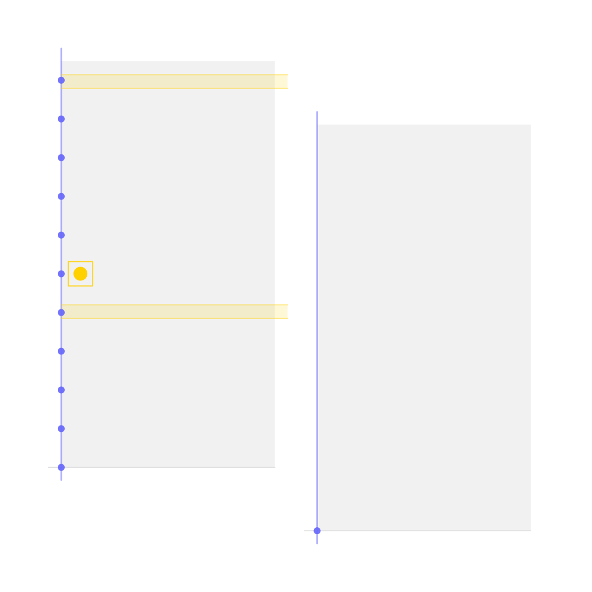
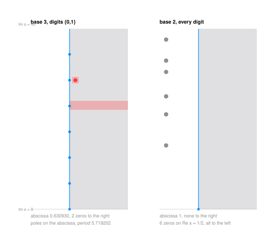

# The Dirichlet Inverse of a Digit Design and the Transport of Zeros

<picture><source media="(prefers-color-scheme: dark)" srcset="figures/avatar-dark.png"></picture>

> **Draft.** This lane is written, built and checked, but it has not had its outside read yet. Read it as a preprint of a preprint.

Cross out some digits of a base and keep the numbers you can still write: base 10 without the digit 9 leaves 1 to 8, 10 to 18, 20 and so on. That set has a zeta function, a Dirichlet series built from the set and nothing else, and this paper asks what plays the part of the Mobius function for it. The answer is forced and classical in shape, the Dirichlet inverse of the set's indicator, and it is the Mobius function only when nothing was crossed out. What is new is how badly it behaves. The set's zeta function has zeros inside its own half-plane of absolute convergence, which the Euler product forbids for the integers, and every such zero pushes the inverse's abscissa to the right. So the set's own Mobius function does not cancel against the set's own size. It anti-cancels.

Write $S_F$ for the design, $\alpha = \log_q k$ for its abscissa with $k$ surviving digits, $\zeta_F(s) = \sum_{n \in S_F} n^{-s}$, and $\nu_F$ for the Dirichlet inverse of the indicator of $S_F$, so that $\zeta_F(s) N_F(s) = 1$.

**Theorem (the transport).** If $\rho$ is a zero of $\zeta_F$ with $\mathrm{Re}\\,\rho > \alpha$, then $\sigma_c(N_F) \ge \mathrm{Re}\\,\rho$, and hence

$$\sum_{n \le x} \nu_F(n) \;\ne\; O\\!\left(x^{\mathrm{Re}\\,\rho - \varepsilon}\right) \quad \text{for every } \varepsilon > 0 .$$

The proof is the identity theorem on a pole-free half-plane and takes half a page; it is worth stating because of what it is fed. Two zeros have been located by the argument principle inside boxes ten thousandths wide. At base 3 on the digits 0 and 1 the box sits at $\mathrm{Re}\\,s \in [0.72074, 0.72084]$, while the whole design has only about $x^{0.630930}$ elements below $x$: the partial sums of its own Mobius function are, along a sequence, bigger than the number of terms being summed. At base 10 missing the digit 9 the box sits at $\mathrm{Re}\\,s \in [1.00150, 1.00168]$, to the right of the line where all the integers sit, so the partial sums exceed even $x$.

The paper also records what a design has instead of an Euler product: the indicator of $S_F$ is multiplicative exactly when no digit was crossed out, with a coprime witness written down in every other case, and what survives is a product over digit positions in the frequency variable rather than over primes. Two neighbouring structures, a Lyndon word product and a Beurling system on the primes lying inside the design, are stated precisely in order to say what each one cannot see.

`python3 scripts/verify.py` recomputes the Dirichlet inverse at base 3 on $\\{0,1\\}$ out to $n = 3^8$ and checks $\zeta_F N_F = 1$ as a coefficient identity by a second code path, asserts the constructed multiplicativity witness at all 120 relevant digit sets of the bases 2 to 7, checks the position-product identity exactly on the grid, expands the Lyndon product in exact integers, and re-evaluates $\zeta_F$ at the two box centres through the peel recursion. The winding-number certification itself lives upstream and the paper says so.

- [paper.pdf](paper.pdf) - the paper.
- `tectonic paper.tex` rebuilds it; `python3 scripts/verify.py` reruns every check in about a second; `python3 scripts/figure.py` redraws the figure.
