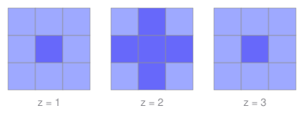

# Divisor Avatars: Which Parity Designs Count the Divisors of a Power

Take a cube of small cells, number the coordinates from one, and throw away every cell with at least two even coordinates. That is the first step of the Menger sponge. At side 3 it keeps 20 cells; at side 5 it keeps 81; at side 2n+1 it keeps exactly as many cells as the number 240 raised to the n has divisors. A geometric census is computing an arithmetic function, and this paper settles exactly when that can happen: an integer x has such a design if and only if it has at most twice as many prime factors with multiplicity as it has distinct ones.

A *design* in dimension $D$ is a set $F$ of parity patterns, a subset of $\\{0,1\\}^D$. A cell of the grid $\\{1,\dots,2n+1\\}^D$ is *filled* when the pattern of which of its coordinates are even lies in $F$. The number of filled cells is the *fill* $P_F(n)$, and $F$ is a *divisor avatar* of $x$ when $P_F(n) = d(x^n)$ for every $n \ge 0$. The Menger design keeps every pattern with at most one even coordinate, and $P_F(n) = (n+1)^2(4n+1) = d(240^n)$.

**Theorem.** Let $x = q_1^{a_1}\cdots q_D^{a_D}$ with $D = \omega(x)$ distinct primes and every $a_i \ge 1$. A design of dimension $D$ with fill $d(x^n)$ exists if and only if $\Omega(x) \le 2\,\omega(x)$, that is $\sum_i (a_i - 1) \le D$. When it exists its weight signature is forced to be $f_w = e_w(a_1-1,\dots,a_D-1)$, and exactly $\prod_w \binom{\binom{D}{w}}{f_w}$ designs realize it. No design of any other dimension has that fill.

The proof is one substitution and one inequality. Writing $b_i = a_i - 1$ turns $a_i n + 1$ into $b_i n + (n+1)$, so $d(x^n) = \sum_w e_w(b)\,(n+1)^{D-w} n^w$, which is the fill of the signature $e_w(b)$; a design can hold at most $\binom{D}{w}$ patterns of weight $w$, and $e_1(b) \le D$ is both necessary and, by a coefficientwise domination $\prod_i (1+b_i t) \preceq (1+t)^D$, sufficient for all the caps at once. Counting the qualifying polynomials turns into counting partitions: $\sum_{m \le D} p(m)$, the sequence A000070, giving $2, 4, 7, 12, 19, 30$ in dimensions one to six. The scripts re-check all of it: the fill law for all 256 three-dimensional designs, the criterion against a design search for every $x$ up to 3000, the sponge's $d(240^n)$ and its void $n^2(4n+3)$ (A395241) cell by cell to side 21, the 131 powers above 5040 on the seven three-dimensional ladders that satisfy Robin's inequality with maximum ratio 1.573259905933 at 14400, the first colossally abundant number with *no* avatar (21621600, with $\Omega = 13 > 12$), and a nine-observable scan of all 22 orbit representatives that finds exactly eight non-fill divisor identities.

- [paper.pdf](paper.pdf) - the paper.
- `tectonic paper.tex` rebuilds it; `python3 scripts/verify.py` re-checks every number; `python3 scripts/figure.py` redraws the sponge slices.
