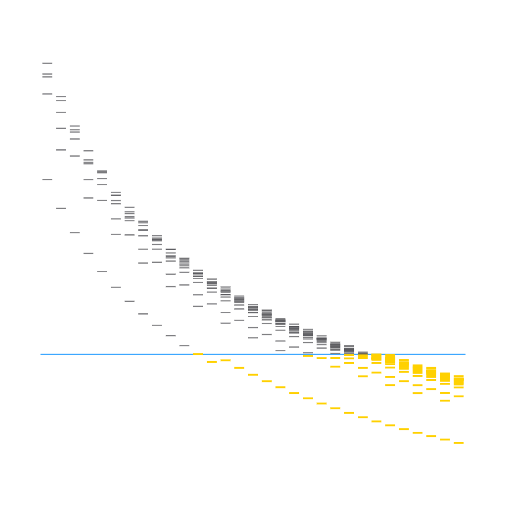
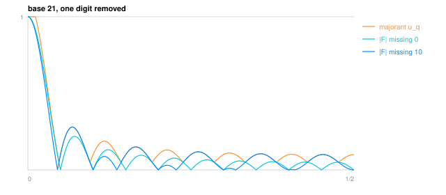

# The First Base Below a Quarter

<picture><source media="(prefers-color-scheme: dark)" srcset="figures/avatar-dark.png"></picture>

> **Draft.** This lane is written, built and checked, but it is not finished work: the threshold it aims at is still under review upstream, and the paper says so in its own words. Read it as a preprint of a preprint.

Fix a base and cross out one digit. What is left is the set of integers you can still write, and every analytic result about such a set - Maynard's primes with restricted digits, the sieve theorems that followed - passes through a single number: the $\ell^1$ exponent $\alpha_1$ of the set's Fourier transform, which measures how much of the transform survives when the whole grid of frequencies is added up in absolute value. Small is good. The published values sit near a third. A quarter is a different demand, and this paper finds where it is first met: base $21$ with the digit $0$ removed, and base $34$ if you want *every* excluded digit to clear.

Write $F = \\{0,\dots,q-1\\} \setminus \\{a_0\\}$ for the surviving digits, $\widehat{F}(t) = \frac{1}{q-1}\sum_{a \in F} e(at)$ for its normalised transform and $\widehat{F}_N(t) = \prod_{j<N} \widehat{F}(q^j t)$ for the transform of the $N$-digit strings. The exponent is the growth rate of the shifted grid sums,

$$\alpha_1 \;=\; \lim_{N \to \infty} \frac{1}{N} \log_q \max_x \sum_{i < q^N} \left| \widehat{F}_N\left(x + \frac{i}{q^N}\right)\right| .$$

**Theorem.** For every base $q \ge 126$ and every excluded digit, $\alpha_1 < 1/4$. The bound is uniform in the digit and reads $0.249808$ at $q = 126$, $0.231905$ at $q = 200$ and $0.108949$ at $q = 10^6$.

**The two floors.** Base $21$ missing the digit $0$ is the least base carrying any such set below a quarter, clearing by about $10^{-5}$; all $108$ sets of every base below $21$ miss. Base $34$ is the least base whose every excluded digit clears, all $17$ of them; each base from $21$ to $33$ still carries a digit that misses. Joining the two floors to the theorem gives: every base $q \ge 34$ clears at every excluded digit, and $34$ is exact.

The theorem is elementary. The triangle inequality trades the excluded digit for a phase of modulus one, leaving a majorant built from the Dirichlet kernel that names the base and forgets the digit - the envelope in the picture above. Its level-$N$ product expands over subsets of the digit positions, every maximal run of consecutive positions telescopes into one Dirichlet kernel at a higher modulus, and what remains is a sum of $2^N$ Lebesgue sums, each bounded by the Lebesgue constant of its own modulus. The bookkeeping closes into a cubic in one variable, and the cubic clears a quarter from $q = 126$ up. The floors are computations: a transfer matrix on windows of digits brackets $\alpha_1$ from both sides, and a Collatz-Wielandt test turns a power-iteration guess into a rigorous one-sided bound. The script reruns all of them, $108$ lower bounds below the floor, the decisive five-digit window at base $21$, the thirteen witnesses from $21$ to $33$, and all $17$ upper bounds at base $34$.

One row it does not rerun. Closing the interval between the two floors needs the bases $35$ to $125$ as well, all $3663$ of their one-missing-digit sets, and that sweep is too slow for plain Python; the paper states it as its own fact and attributes it to the interval-arithmetic generator [lab/digit-transform-norms](https://github.com/mrlyprod/mrlyprod/tree/main/research/lab/digit-transform-norms), which runs the same Collatz-Wielandt tests under `mpmath` at 96 bits. It is the only external dependency in the lane, and only the "every base $q \ge 34$" statement uses it.

- Grew from the [coprime](https://github.com/mrlyprod/mrlyprod/blob/main/research/coprime.md) page of the MrlyMath tree.
- [paper.pdf](paper.pdf) - the paper.
- `tectonic paper.tex` rebuilds it; `python3 scripts/verify.py` reruns every check in about thirty seconds; `python3 scripts/figure.py` redraws the transforms.
