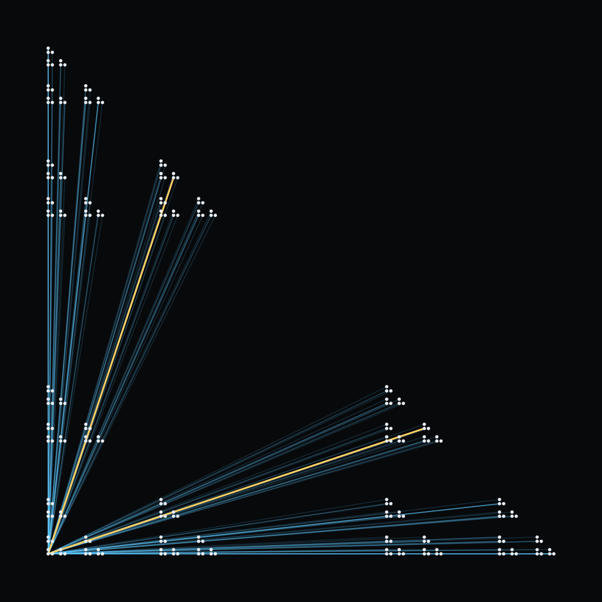
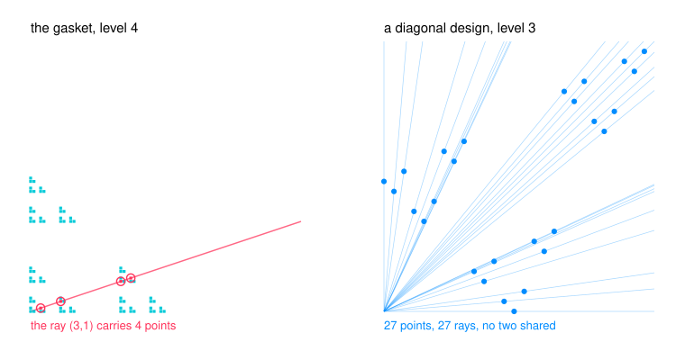

# Base-3 Digit Designs: Diagonality, Ray Masses, and a Spectral Gap at Two

Write two numbers in base three at once, stacked, so each digit position carries a pair from the nine possibilities; keep three of those nine pairs and forbid the rest. You get a self-similar cloud of points in the plane. Now ask the simplest question available: which straight lines through the origin hit the cloud, and how many points does each line catch? Some designs pile everything onto a few lines. Others spread every single point onto a line of its own, and it turns out you can tell which is which by looking at one digit.

A design is a three-element set $F \subseteq \{0,1,2\}^2$, and its level-$n$ points are $\sum_{i<n} 3^i d_i$ with every $d_i \in F$. Two families appear here and they are different objects: the gasket $G = \{(0,0),(1,0),(0,1)\}$, and the permutation designs $F_\phi = \{(0,\phi(0)),(1,\phi(1)),(2,\phi(2))\}$ for a permutation $\phi$ of $\{0,1,2\}$. Call $F$ *diagonal* when no two distinct nonzero points of any level are collinear with the origin.

## Diagonality is one digit

**Theorem.** $F_\phi$ is diagonal if and only if $\phi(0) \neq 0$ - four of the six permutations. For those four and every $n \ge 1$, the $3^n$ points occupy $3^n$ distinct rays, exactly two of them the coordinate axes, so the number of occupied non-fibre rays is $Z_{F_\phi}(n) = 3^n - 2$.

The proof is six lines: every permutation of $\{0,1,2\}$ is affine over the field of three elements, and after one cancellation the cross determinant of two points whose digits first differ at position $k$ comes out congruent to $3^k \phi(0)(d_k - d_k')$, which is nonzero exactly when $\phi(0)$ is.

## Ray masses are exact recurrences

Gasket ray masses obey exact linear recurrences at every level: $M_n(3,1) = F(n+1) - 1$, $M_n(1,12) = A000930(n) - 1$, $M_n(7,3) = c(n-3) - 1$ with $c(0..3) = 1,2,3,4$ and $c(m) = c(m-1) + c(m-4)$. Each recurrence is the characteristic polynomial of a live carry automaton with two, three or four states, so Cayley-Hamilton proves it outright. On a shift ray the mass is a product of Fibonacci numbers, $M_n(3^j,1) = \prod_{r<j} F(m_r+2) - 1$, because the admissible multipliers are the binary strings with no two ones at distance $j$; summing the squares over the whole family gives $\mathrm{Sh}(n) < 2.803\,\varphi^{2n}$ for every $n$, with $\mathrm{Sh}(n)/\varphi^{2n} \to (13 + 5\sqrt5)/11 = 2.198212717$.

## A spectral gap at two

Over all 829 coprime pairs with $\max(s,t) \le 52$, the growth rate of $\{z : z, sz, tz \in G_n\}$ is $3$ on the three shift pairs, exactly $2$ on twenty pairs, at most $1.6956207696$ on the rest, and never in between. Drop the requirement $z \in G_n$ - which is what a census of collinear pairs actually needs, and at level $9$ the two counts differ on 482 of the 2656 active ordered multiplier pairs - and three of those four items survive verbatim: radius $3$ on exactly those three shift pairs, nothing in the open interval $(2,3)$, and exactly $2$ on the same twenty. The ceiling below $2$ does not survive: it rises to $1.8488475886$, attained by $(4,13)$, $(4,39)$, $(12,13)$ and $(13,36)$, and the old ceiling $\theta = 1.6956207695598$, the real root of $x^3 - x^2 - 2$, is reached or beaten by 44 pairs - 19 strictly above it, 25 exactly at it.

## The witness is the right coordinate

Every off-diagonal collinear pair of $G_n$ is $(sz, tz)$ for a unique coprime $(s,t)$ and a unique *witness* $z$, so the residual $R(n)$ can be summed over witnesses instead of over multiplier pairs - and the multiplier pairs were the obstruction, since they already number about $2.77^n$. In the witness coordinate the constants are golden. No witness weighs less than four, which forces the largest multiplier at level $n$ to be exactly $\lfloor 3^n/8 \rfloor$; every pair above $(3^n-1)/10$ carries exactly four collinear pairs; the weight layers scale exactly by three, $R_{3w}(n) = R_w(n-1)$; and the weight-four layer is closed in Fibonacci, $R_4(n) = 2\#\{(a,b) \in F_n^2 : a \neq b, \gcd(a,b)=1, b/a \neq 3^{\pm j}\}$ with $\#F_n = F(n+1)-1$, so its whole 3-power orbit stays below $1.6945\,\varphi^{2n}$ - the same golden law that closed the shift family. Measured to level 17, $R(n)/3^n$ falls from $0.84012$ at $n=8$ to $0.27377$, and $R(n)/\varphi^{2n}$ peaks at $3.2378$ at $n=12$ and falls to $2.7725$.

## The golden ceiling

**The shift ray $(1,3)$ is the heaviest ray of the gasket at every level:** $M_n(z) \le M_n(1,3) = F(n+1)-1$. That is now proved rather than enumerated, at every level and not just to 40, on a box of 13158 coprime directions. The mechanism is a branch count. In the direction coordinate a multiplier word is a word over the increments $\{0, z_2, -z_1\}$ summing to zero; its carry automaton has out-degree at most two, the branching states sit in one residue class mod 3, and when no branching state has two branching successors the path count obeys $G(n) \le G(n-1) + G(n-2)$ outright. That settles 206 of the 218 occupied directions of the box; three of the twelve left are shift rays, closed by $F(p+2)F(q+2) = F(p+q+3) - F(p+1)F(q+1)$, and the other nine carry explicit rational certificates.

## One inequality per direction: $U(z)$

Weight the first returns of the carry automaton by $\varphi^{-1}$ per step and read off a single algebraic number $U(z) \in \mathbf{Q}(\sqrt5)$. **If $U(z) \le \varphi^{-2}$ then the ceiling holds for that direction at every level**, by a maximum principle for the weighted path count against the Fibonacci envelope $\varphi^{m-2} \le F(m) \le \varphi^{m-1}$. Across the box and six overlapping adversarial families, 865 directions are occupied, 858 pass, and the seven that fail are exactly the shift rays, where $U = \varphi^{-1}$ exactly and the Fibonacci product identity takes over. The criterion is attained only on the supergolden directions $(1,12)$, $(3,10)$, $(4,9)$, and $U$ never lands between $\varphi^{-2}$ and $\varphi^{-1}$. So the golden ceiling is one inequality per direction rather than one per direction and level, and **the golden partition bound** - $U(z) \le \varphi^{-2}$ at every non-shift direction - is the open conjecture that would make the ceiling a theorem outright. Two restatements carry no automaton at all: it says $\sum_n (M_n(z)+1)\varphi^{-n} \le \varphi^4$, and equivalently $\sum_m \varphi^{-\ell(m)} \le \varphi$ over the multipliers $m$ of $z$, where $\ell(m)$ is the base-3 length of $(z_1+z_2)m$.

## Proved on an infinite family

Write $q = 3^k q_1$ for the coordinate divisible by three ($3 \nmid q_1$) and $p$ for the other.

- **Occupancy is a congruence first.** A ray carrying any mass at all forces $q_1 \equiv p \bmod 3$ - two lines on last digits, no automaton - and that alone empties 4588 of the 11691 census directions with $3 \mid z_1z_2$.
- **Short first returns are classified.** No first return has length between $2$ and $k$; $f_2 \neq 0$ only at $\{1,3\}$, and $f_3 \neq 0$ only at $\{1,9\}$, $\{1,12\}$, $\{3,10\}$, $\{4,9\}$. So $U = \varphi^{-2}\sum_{j\ge3} f_j \varphi^{3-j}$, and $U \le \varphi^{-2}$ forces $f_4 \le 1$.
- **The golden partition bound, proved.** For $k = 1$ and $t = v_3(q_1 - p)$: $U(z) \le \varphi^{-1}\bigl(1 - \varphi^{-\max(t,2)}\bigr)$. Hence $U \le \varphi^{-2}$ on the whole arithmetic class $k = 1$, $t \le 2$ - infinitely many directions, 261 of the 360 occupied ones in the census - sharply at $(1,12)$ where $t=1$ and $(3,10)$ where $t=2$. And $U < \varphi^{-1}$ for every such ray but $(1,3)$, which is the first proof that a whole family of gasket rays grows *strictly* slower than $\varphi$.
- **The degree potential.** A two-valued potential read off the out-degrees - $1$ where a live state branches, $\varphi^{-1}$ where it does not - is a super-solution of the criterion whenever no branch state has two branching successors, and sweeping it under the same operator gives a decreasing chain of exact bounds on $U$. Swept, it replaces the linear solve on 849 of the 865 occupied directions, 37 of them outside the branch case, at least depth 1 for 760, 3 for 48, 4 for 31, 5 for 7 and 6 for 3. The sixteen left over are seven shift rays and nine named directions.
- **What blocks the rest.** For $k \ge 2$ the burst forces $\varphi^{-2} \ge \pi(c_0) \ge \varphi^{-(k-1)}\sum_m \pi(q_1m)$ over $2^{k-1}$ burst-floor states of valuation $0$, while $\pi(p) \ge \varphi^{-1}$ at the valuation-$0$ state $p$. Any valid potential must separate states of equal valuation by a factor $\varphi^2(2/\varphi)^{k-1}$, which grows without bound - so no potential constant on the level sets of $v_3$, and no potential constant on the out-degree classes, can work there at all.

## Two constructions that make the automaton cheap

The free-digit automaton is a constrained tensor square of a one-coordinate carry automaton, $T^\flat = S \otimes S - U \otimes U - V \otimes V + W \otimes W$, so its four-tuple state graph never has to be built; and at large multipliers the witness box $z_1 + z_2 \le (3^n-1)/(2t)$ replaces the automaton entirely, cheapest exactly where a forward build is most expensive.

- Grew from the [coprime](https://github.com/mrlyprod/mrlyprod/blob/main/research/coprime.md) page of the MrlyMath tree.
- [paper.pdf](paper.pdf) - the paper.
- `tectonic paper.tex` rebuilds it; `python3 scripts/verify.py` re-checks every number in about 100 seconds; `python3 scripts/figure.py` redraws the two panels.
