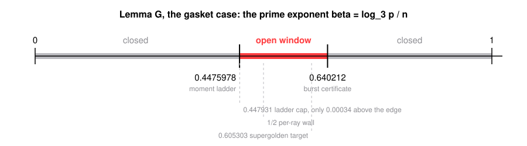

# The Pincer at Dimension One: Two Edges and Two Closed Doors

Take the base-3 Sierpinski gasket at level `n` - the `3^n` lattice points whose base-3 digit pairs all come from `{(0,0),(1,0),(0,1)}` - and ask how often a point's two coordinates are coprime. Above dimension one the answer is a theorem. Exactly at dimension one, where the gasket lives, one estimate is missing, and it is missing only for primes of one particular size. This paper squeezes that size range from both ends and then proves that the two obvious ways to squeeze further are shut.

Measure a prime by its exponent against the level, $\beta = \log_3 p / n$. A big prime in a common factor forces a short ray $(a,b)$, and counting the multiples of a ray inside the gasket is a finite automaton on the base-3 digits of the multiplier, with growth rate $\rho(a,b)$. There are infinitely many rays and the automata grow like $ab$, so no computation settles them.

**Theorem.** $\rho(a,b) \le \varphi$ for every primitive ray, at every 3-adic depth, and therefore Lemma G - the gasket case of the coprimality programme's Lemma B, and the only case this paper claims - holds for every prime exponent $\beta > 1/(2 - \log_3 \varphi) = 0.6402121938$, unconditionally.

Combine that with the lower edge $0.447597813453$, the tenth rung of a separate Fourier moment ladder, which that machine proves elsewhere and which this paper imports rather than reproduces, and the estimate can fail only for $\beta \in (0.447597813453,\ 0.6402121938]$. Both edges are unconditional. The lower one is now within $0.00034$ of the ladder's own structural cap $0.447930988$, so the window will not close from below.

The proof is one injection with no computation in it. When $3^k$ divides the relevant coordinate, a carry state's branching type is fixed $k$ steps in advance, and the two children of a branching state are forced into *different* types exactly $k$ steps downstream: a free choice today costs a forced move on day $k$. Recording the free choices injects the admissible length-$w$ paths into the subsets of $\{1..w\}$ with no two elements at distance exactly $k$, which a product of Fibonacci numbers counts, at most $\varphi^{w+k}$. Two impossibility results follow: keeping the exact Fibonacci product cannot lower the edge, because the depth-one stratum alone reproduces the exponent, and averaging the radii cannot lower it either, because mass is governed by $\rho^w$ and Jensen points the wrong way. `scripts/verify.py` re-checks the bound at every start state of every ray of height at most 24 for every $w \le 20$, the exact saturation $P_{36} = D_2(36) = 45765225$ at $(9,1)$ and $P_{36} = D_3(36) = 53582633$ at $(27,1)$, the 490-ray height-40 catalogue with its largest certificate $1.4812034260$ at $(4,9)$, the order-10 carry matrix behind the lower edge together with its exact degree-25 characteristic polynomial and the Sturm bracket $\lambda_{10} < 6664.1136626$ that certifies $0.447597813453$, and every constant printed above.

- Grew from the [coprime](https://github.com/mrlyprod/mrlyprod/blob/main/research/coprime.md) page of the MrlyMath tree.
- [paper.pdf](paper.pdf) - the paper.
- `tectonic paper.tex` rebuilds it; `python3 scripts/verify.py` re-checks every number; `python3 scripts/figure.py` redraws the number line.
