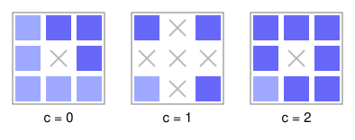

# Pairwise Coprimality in the Menger Sponge

Cut a cube into twenty-seven, throw away the seven that touch the middle, repeat forever: that is the Menger sponge, and reading a surviving subcube's address in base three turns it into a triple of whole numbers. Ask an arithmetic question about that geometry - how often do the three coordinates share no prime factor, pairwise? On the full lattice the answer is a classical constant. On the sponge it is a different one, and the whole difference lives at the single prime 3: drilling the holes costs the coordinates exactly 12.25 percent of their odds.

A level-$L$ sponge point is a triple whose $L$ base-three digit vectors $(a,b,c)$ each have at most one entry equal to $1$; there are $20^L$ of them, and $P_L$ is the fraction whose coordinates are pairwise coprime, with the convention $\gcd(0,n) = n$.

**Theorem.** $\lim_{L\to\infty} P_L = \frac{13}{20}\prod_{p\neq 3}\left(1-\frac{3}{p^2}+\frac{2}{p^3}\right) = \frac{351}{400}\,C_3 = 0.251620868451255\ldots$, where $C_3 = 0.286747428434479\ldots$ is the classical three-integer pairwise-coprimality constant.

Every prime but 3 behaves exactly as it does on the full lattice; at 3 the lattice factor $20/27$ is replaced by $13/20$, because a coordinate is divisible by 3 exactly when its last digit is 0, and only 13 of the 20 digit vectors keep two zeros apart. The other primes need a character estimate and a counting bound fibred over a *pair* of coordinates - fibres of size 3, exponent $\log_3(20/3) = 1.727 > 1$, where the usual one-coordinate fibring gives 8 and $0.834$ and proves nothing. The same proof settles any base-$q$ digit design with $|F| > q\kappa_I$ on every coordinate pair. The scripts re-count all 64 million level-six points ($15{,}141{,}288$ of them pairwise coprime, density $0.236583$) and explain why the finite levels sit *below* the limit: the digits are biased mod 2, and the exact level-$L$ factor at 2 is $\frac12-\frac34(3/5)^L+\frac14(-1/5)^L = 0.4416$ at $L = 5$ against its limit $\frac12$.

- Grew from the [coprime](https://github.com/mrlyprod/mrlyprod/blob/main/research/coprime.md) page of the MrlyMath tree.
- [paper.pdf](paper.pdf) - the paper.
- `tectonic paper.tex` rebuilds it; `python3 scripts/verify.py` re-checks every number; `python3 scripts/figure.py` redraws the design.
