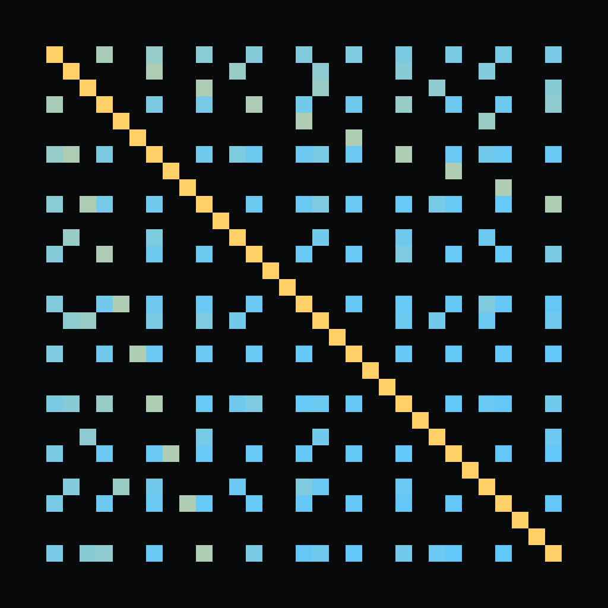
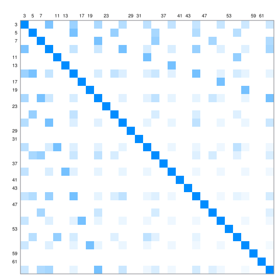

# Parity Carpets Correlate by gcd: Four Exact Laws for a Square-Wave Stack

Cut a square into an odd number of equal strips each way, number the strips from zero, and ink every cell whose column and row numbers are both odd. Draw a second such picture at a different scale and hold the two up to the light. How much do they agree? The answer is one exact number built from the greatest common divisor of the two scales, and it is exactly zero when the scales are coprime - not small, not zero to five decimals, zero. So a picture whose scale is prime agrees with every picture before it exactly as much as chance, and you can see which ones those are: they are the white rows.

Write $s(x) = (-1)^{\lfloor x \rfloor}$ for the square wave and $\chi_n(u) = 1$ exactly when $\lfloor nu \rfloor$ is odd. The picture above is the carpet field $C_n(u,v) = \chi_n(u)\chi_n(v)$, and everything follows from one integral: for positive integers $m, n$ with $g = \gcd(m,n)$, the mean of $s(mu)s(nu)$ over the unit interval is $g^2/(mn)$ when $m/g$ and $n/g$ are both odd, and $0$ otherwise.

**Theorem.** For odd $m, n \ge 3$ with $d = \gcd(m,n)$, the Pearson correlation of the carpets is exactly

$$r(C_m, C_n) = \frac{(d^2-1)\left[2(m-1)(n-1)+d^2-1\right]}{(m-1)(n-1)\sqrt{(3m-1)(m+1)(3n-1)(n+1)}},$$

which is $0$ if and only if $d = 1$, and strictly positive otherwise. The same zero set holds for all four fields the parity rule generates. Hence an odd $n \ge 3$ is prime exactly when its carpet is uncorrelated with every earlier carpet.

The proof is Parseval on the square wave's odd harmonics: $\pi$ enters as $(4/\pi)^2$ and leaves through the odd Basel sum $\pi^2/8$, so every number here is rational. The identity is the odd-harmonic sibling of the classical Franel integral $\int_0^1 ((mx))((nx))\,dx = \gcd(m,n)^2/(12mn)$, which the scripts re-check too. The verifier re-derives the master integral by exact rational integration on the lcm grid for every pair up to 40 and every odd pair up to 99 with zero mismatches, confirms that the unqualified law fails on 532 of those first 820 pairs, counts the two-dimensional cell overlaps directly at six scale pairs, and replays the separation over odd $n$ from 3 to 199: all 45 primes at exactly 0, all 54 composites strictly positive, the narrowest at $n = 169 = 13^2$ with 0.0517383422. The prime criterion is a portrait of coprimality, not a primality test - as an algorithm it is trial division with a picture attached. The paper also computes the stack's whole spectrum: the sine coefficient of the stack at an odd frequency pair $(a,b)$ is an explicit divisor-sum bracket, the interaction part carrying exactly $\sigma_2(\gcd(a,b))/(ab)$, and every spectral statistic is a quotient of zeta values in the Estermann-Ramanujan class - $\sum \sigma_2(\gcd)^2 (ab)^{-w} = \lambda(w)^2\lambda(2w-2)^2\lambda(2w-4)/\lambda(4w-4)$ with $\lambda$ the odd zeta. A stack weighted by $n^{-s}$ renders the divisor function $\sigma_{2-s}$ as its spectrum: a Dirichlet series drawn as a picture. The paper also marks where the exactness stops: it does not survive to a hexagonal section, the brightness carries no Mobius information, so no Riemann-hypothesis criterion can be read off it, and the spectrum adds divisor information only - no new L-function appears.

- Grew from the [hexagon](https://github.com/mrlyprod/mrlyprod/blob/main/research/hexagon.md) page of the MrlyMath tree.
- [paper.pdf](paper.pdf) - the paper.
- `tectonic paper.tex` rebuilds it; `python3 scripts/verify.py` re-checks every number; `python3 scripts/figure.py` redraws the carpet.
