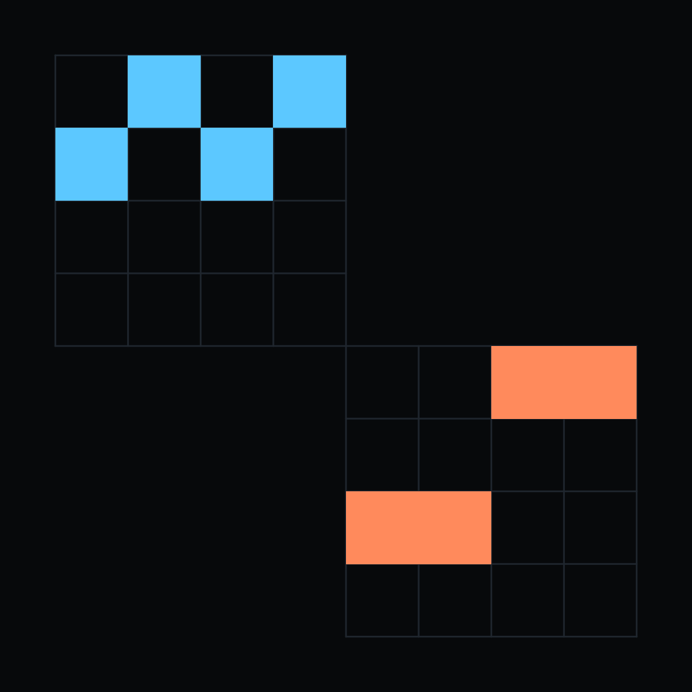
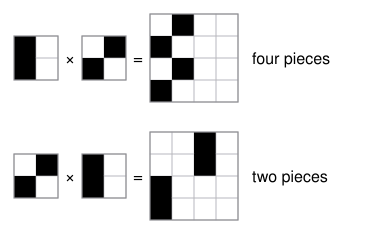

# Order Sensitivity of Kronecker Design Words: What the Perfect Shuffle Cannot See

Nest one small black-and-white pattern inside another, then swap the order of the nesting. The picture keeps its size and its number of black cells, and every algebraic thing about it - rank, determinant, spectrum, trace - stays put, because the two orders differ by a perfect shuffle of rows and columns. But a shuffle does not preserve which cells touch which. So the picture can fall apart into twice as many pieces, and this paper says exactly which observables that breaks and how early.

A *design* is a two-by-two square with some of its four cells filled, so there are sixteen of them. A word $w = (c_1, \dots, c_L)$ of designs gives the $2^L \times 2^L$ picture $A_w = A_{c_1} \otimes \cdots \otimes A_{c_L}$, outermost factor first. An observable is *order-blind* if it depends only on the multiset of letters, and *order-sensitive* if reordering can change it.

**Theorem.** $\operatorname{comp}(A_3 \otimes A_6) = 4$ and $\operatorname{comp}(A_6 \otimes A_3) = 2$, and among the six two-cell designs a connected pair against a diagonal pair *never* commutes: always $4$ against $2$. Connected pairs commute with connected pairs, diagonal pairs with diagonal pairs, and every pair of designs with three or more cells gives $1$ in both orders.

The proofs are contact geometry: two adjacent copies of a tile touch only when its facing edges share a filled row or column, and that contact count is a product over the factors, so it cannot see the order - while the merging it permits can. Beyond the theorems the paper ships an exhaustive census (over the $105$ reorderable length-two multisets: components split on $74$, Euler characteristic on $78$, perimeter on $78$, holes on $10$, boundary cells on none) and six explicit $4 \times 4$ integer matrices whose products reproduce the component count of every one of the $54{,}241$ words of length at most four, zero mismatches. Why the rank is $4$ is open, and an earlier claim that no such representation could exist is retracted in the paper, with its date.

- [component-exponent-of-kronecker-words](../component-exponent-of-kronecker-words/) - the sequel: closed forms for the component count on all 105 two-letter alphabets, and the growth rate they give, which is order-blind at every interior letter frequency.
- [paper.pdf](paper.pdf) - the paper.
- `tectonic paper.tex` rebuilds it; `python3 scripts/verify.py` re-checks every number in about four seconds; `python3 scripts/figure.py` redraws the witness.
