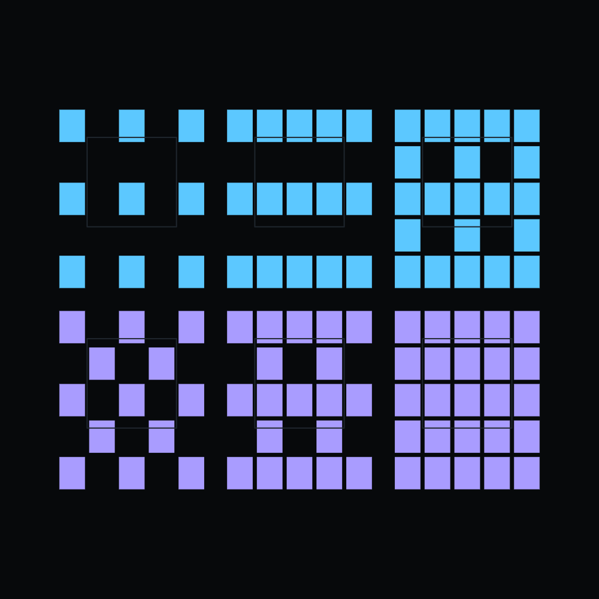
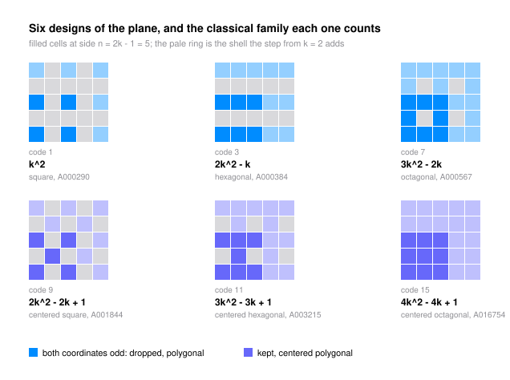

# The Sequence Census of a Parity Design

Colour the cells of a grid by the parity of their coordinates, keep a chosen set of colours, and count what you kept. Every such rule writes an integer sequence, and this paper counts the sequences rather than admiring them. In dimension $D$ there are $2^{2^D}$ rules but only $\prod_{w=0}^{D}\left(1+\binom{D}{w}\right)$ distinct counting sequences, and in the plane every one of them is a classical figurate number - which one being decided by two bits of the rule.

A *design* is a subset $F$ of the parity cube $\{0,1\}^D$; a cell of the grid of odd side $n = 2k-1$ is filled when the parities of its coordinates spell a corner of $F$. Write $f_w$ for the number of kept corners of Hamming weight $w$.

**Theorem (fill law).** $P_F(k) = \sum_{c \in F} k^{D-|c|}(k-1)^{|c|} = \sum_{w=0}^{D} f_w k^{D-w}(k-1)^w$, a polynomial with leading coefficient $|F|$, of degree exactly $D$ for every nonempty design and identically zero for the empty one.

**Corollary (the census).** The $2^{2^D}$ designs of dimension $D$ write exactly $\prod_{w=0}^{D}\left(1+\binom{D}{w}\right)$ distinct sequences - $2, 4, 12, 64, 700, 17424, \dots$ - because the polynomial remembers only the weight signature.

**Theorem (the plane is classical).** In dimension two, a nonempty design with $f_0 = 1$ fills as the $(2|F|+2)$-gonal number when $f_2 = 0$ and as the centered $2|F|$-gonal number when $f_2 = 1$; the remaining nonzero rules fill as one of those polygonal numbers read at the reflected argument $1-k$, or as a multiple $f_1 k(k-1)$ of the oblong numbers. So the squares, hexagonal numbers, octagonal numbers, centered squares, centered hexagonal numbers and odd squares are not six coincidences but one mechanism, and the family is read off the rule by inspection.

**Theorem (surface law).** Substituting a tile of $c$ cells multiplies exposed faces by $c$ and buries $2W_a l_a^L$ of them along each axis $a$, where $l_a$ is the tile's face fill and $W_a$ its face-adjacent filled pairs; so the exposed-face count is C-finite of order at most $D+1$, on roots drawn from $\{c, l_1, \dots, l_D\}$. Order two - the Menger sponge's $2 \cdot 20^L + 4 \cdot 8^L$, the carpet's perimeter - is the special case of one face fill, and it is the exception: 141 of the 255 nonempty rules of the cube carry two or more.

**Theorem (the crossover).** The count of distinct sequences exceeds the count of distinct shapes in dimensions one to four and is exceeded by it from dimension five on, the ratio growing past $3.8 \times 10^8$ by dimension six: the machine draws far more pictures than it can count.

Two evaluations do the work. $P_F(1) = f_0$ asks whether the unit cell is filled and $P_F(0) = (-1)^D f_D$ asks whether the all-odd cells are kept, and a quadratic normalised at $0$ and $1$ is pinned by its leading coefficient alone - so the classical families are a bottleneck every planar count of this kind must pass through, not a signal of common ancestry. That is also why the centered hexagonal numbers of the diagonal slice of the odd cube, which arrive by a genuinely different mechanism, collide with the same catalogue entry. The paper also records which of these sequences the OEIS already holds, Burnside counts along the symmetry axis, and one conjecture about a catalogue absence, carrying the caveat that a null search against a downloaded snapshot is a report on that snapshot and nothing more - the paper's own worked example being the level-one diagonal slice, which counts $D!/\lfloor D/2\rfloor!^2$ cells and is therefore A056040, the swinging factorial, however unfamiliar its interleaved terms look.

- Grew from the [sequences](https://github.com/mrlyprod/mrlyprod/blob/main/research/sequences.md) page of the MrlyMath tree.
- [paper.pdf](paper.pdf) - the paper.
- `tectonic paper.tex` rebuilds it; `python3 scripts/verify.py` re-checks every number and reprints every table; `python3 scripts/figure.py` redraws the figure.
