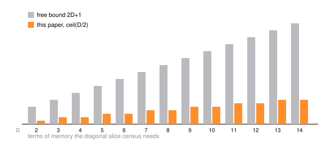

# Menger Diagonal Slices: A Recurrence of Order $\lceil D/2 \rceil$

Slice a Menger sponge along its main diagonal, count the cubes the cut meets, and repeat in every dimension. The counts are not arbitrary: each one is decided by the few before it. A carry automaton with a contraction and a reflection shows that in dimension $D$ only $\lceil D/2 \rceil$ previous terms are ever needed - about a quarter of the $2D+1$ that the standard construction hands you for free. At $D = 3$ the machine returns the published spectrum of the hexagon-triangle substitution without ever seeing a hexagon.

Keep the cells of the base-3 grid whose digit vector has at most one coordinate equal to the middle digit $1$; that is the $D$-dimensional Menger analog. Let $a_D(L)$ count the cells of its level-$L$ approximation that meet the central diagonal hyperplane $\sum_i x_i = D(3^L-1)/2$.

**Theorem.** For every $D \ge 2$, $a_D(L)$ satisfies a linear recurrence with constant integer coefficients of order at most $\lceil D/2 \rceil$, namely the one given by the characteristic polynomial of the $\lceil D/2 \rceil \times \lceil D/2 \rceil$ carry matrix $M_{\mathrm{even}}^{(D)}$.

The proof is three moves: the digit polynomial factors as $P_D(t) = (1+t^2)^{D-1}(1+Dt+t^2)$, the carry map $c \mapsto (c+D-s)/3$ contracts onto $\{|c| \le \lfloor (D-1)/2 \rfloor\}$, and the palindromic symmetry $P_D[s] = P_D[2D-s]$ halves that set. Exactness of the order is verified, not proved: the exact rational Hankel determinant is nonzero for $2 \le D \le 24$, starting $2, 72, -6336, -1029600000, -62272025640000$. The script re-derives the $D = 3$ matrix $[[6,6],[1,3]]$, its polynomial $\lambda^2 - 9\lambda + 12$, and the census $1, 6, 42, 306, 2250, 16578, 122202$ - which is [A299916](https://oeis.org/A299916) - along with the $D = 4$ ladder $6, 132, 1848, 29040, 441408, 6772128$ and the traces $3 \cdot 2^{D-2} - 1$ and $3D \cdot 2^{D-3}$.

- [paper.pdf](paper.pdf) - the paper.
- `tectonic paper.tex` rebuilds it; `python3 scripts/verify.py` re-checks every number; `python3 scripts/figure.py` redraws the bars.
