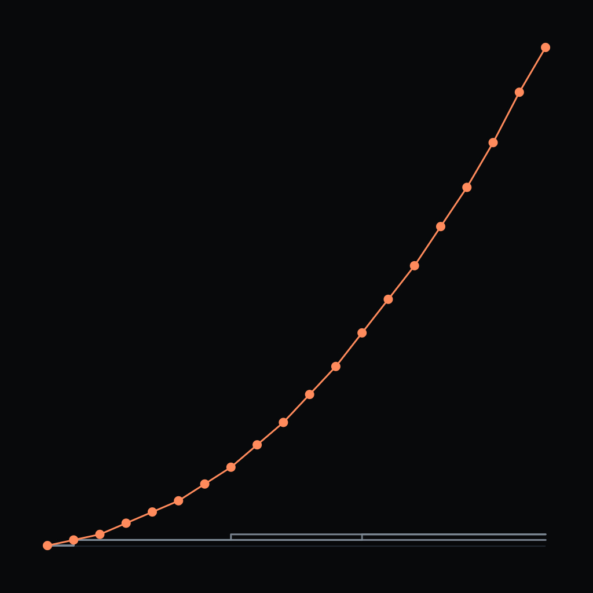
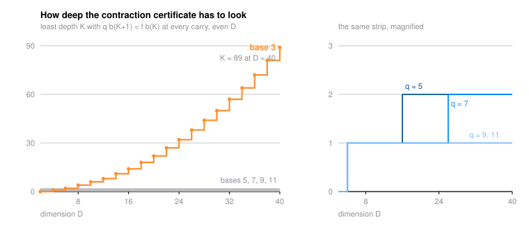

# The Even Half of the Slice Sign Law

Slice a Menger-like solid through its centre, perpendicular to the main diagonal, and count the cells the cut meets as the solid is refined. The count grows geometrically, and its growth exponent misses the generic codimension-one value in every dimension - above it when the dimension is odd, below it when the dimension is even. The odd half of that sign law was proved in [slice-recurrence-order](../slice-recurrence-order/). This paper proves the even half, at base 3 and at base 5, in every even dimension at once.

**Theorem.** On the base-5 middle-digit design, $\rho_D < f_D/5$ for every even $D \ge 2$, where $\rho_D$ is the Perron root of the carry matrix and $f_D = 4^{D-1}(D+4)$ is the fill.

**Theorem.** On the base-3 middle-digit design ($D$-dimensional Menger analogue), $\rho_D < f_D/3$ for every even $D \ge 2$, with $f_D = 2^{D-1}(D+2)$.

Both proofs run on one machine: an exact integer Collatz-Wielandt certificate, a Fourier form in which the leading fill-powers cancel identically, and a frequency-separation estimate. Base 5 needs certificate depth $\Theta(\log D)$; base 3 needs $\Theta(D^2)$, and the paper identifies the quadratic constant exactly as $\tfrac14\log R = 0.0568486146\ldots$ with $R = \prod_{i\ge2}\cos(\pi/3^i)/\cos(2\pi/3^i)$ - the transient is the crossing of the half-point frequency, and a one-line lemma shows base 3 is the unique base that has one. Exact certificates settle bases 7, 9, 11 on finite ranges with no transient at all.

**Theorem (the tent rank law).** For odd $D$, the mod-2 nullity of the even carry core is $\min_{t\in T}(|D-t|/2+1)$ over $T = \{2J(k)+1, 2J(k)+3 : k \ge 2\}$, with $J(k) = (2^k-(-1)^k)/3$ the Jacobsthal numbers - a piecewise-linear tent, at most $\lceil n/3 \rceil$, with equality exactly at $D \in \{3\} \cup \{2^{2j}+1 : j \ge 1\}$.

The tent is layer one of a 2-adic Smith cascade behind the last open piece of the sign law - strictness at odd $D \equiv 1 \pmod 3$ - which the paper reduces to a single valuation conjecture, states the layer-two window law with its Jacobsthal-repunit generator, and leaves with six sharply-stated open problems.

- Grew from the [spectra](https://github.com/mrlyprod/mrlyprod/blob/main/research/spectra.md) page of the MrlyMath tree.
- [paper.pdf](paper.pdf) - the paper.
- `tectonic paper.tex` rebuilds it; `python3 scripts/verify.py` re-runs all ten checks in about twenty-one seconds (`--deep` extends the two largest domains, about twenty-four seconds); `python3 scripts/certify.py` re-certifies every interval constant in the paper, in exact rational arithmetic with outward rounding, in about six seconds; `python3 scripts/figure.py` redraws the figures and re-checks the certificate depths and the tent law behind them. Nothing in the paper is left to a floating-point evaluation and nothing is left unbundled.
