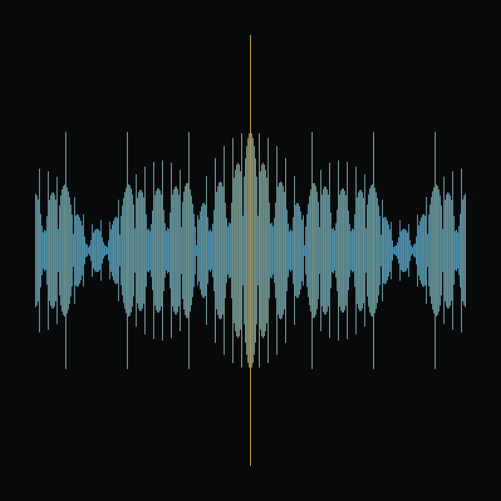
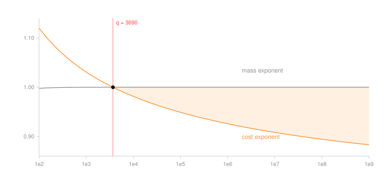

# A Power Saving for Mobius Sums on Missing-Digit Integers, under GRH

Write out the whole numbers whose base expansion never uses one chosen digit - in base ten with the `7` thrown away, that is `1, 2, 3, 4, 5, 6, 8, 9, 10, ..., 16, 18, ..., 69, 80, ...` - and add up the Mobius function over them. The Mobius function is `+1`, `-1` or `0` according to how a number factors, and adding it up over all integers is the question the Riemann hypothesis answers. Adding it up over a missing-digit set is the same question on a set that has no multiplicative structure at all, and the free answer is the number of terms. We beat the free answer by a fixed power, on the generalized Riemann hypothesis, for every base from 3690 up.

Let $q$ be the base, let $F$ be the digits that survive, let $S_F$ be the integers all of whose base-$q$ digits lie in $F$, and put $A_F(x) = \\#\\{n \in S_F : n \le x\\}$ and $M_F(x) = \sum_{n \in S_F, n \le x} \mu(n)$. The set has mass exponent $\alpha_q = \log_q(q-1)$, so $A_F(x)$ is about $x^{\alpha_q}$, and $|M_F(x)| \le A_F(x)$ is free.

**Theorem.** Assume the generalized Riemann hypothesis for Dirichlet $L$-functions. Let $q \ge 3690$ and let $F$ omit exactly one digit. Then $|M_F(x)| \ll_{q,\varepsilon} x^{3/4 + c_q + \varepsilon}$, with $3/4 + c_q < \alpha_q$, so $|M_F(x)| \ll_{q,\delta'} A_F(x)^{1-\delta'}$ for every fixed $\delta' < \delta_q = (\alpha_q - 3/4 - c_q)/\alpha_q$. Here $c_q = \log_q(1 + \Phi_q/q)$ is explicit, of size $\ln\ln q / \ln q$, so $\delta_q \to 1/4$ as the base grows.

The proof is five steps and only one of them is analytic. Expand the indicator of a digit string into additive frequencies; the transform factors over digit positions, so its $\ell^1$ norm obeys a one-step recursion costing one constant per digit; bound that constant by elementary trigonometry on a grid of $q$ equally spaced points, where the missing digit is handled by an exact Parseval identity rather than an estimate; hit every frequency with the uniform Mobius exponential-sum bound of Baker and Harman, which under the generalized Riemann hypothesis is $x^{3/4+\varepsilon}$; and check that past a computable base the norm costs less than the set's own mass. Nothing but the quoted bound names the exponent $3/4$, so the same argument runs on any zero-free half plane for Dirichlet $L$-functions, at a base the paper computes for each: a half plane at $\sigma > 19/20$ still buys the saving, at a base with 84 decimal digits. The paper also proves the wall. The $\ell^1$ norm can never be below one, because the shifted-grid energy is exactly $qk$ at every digit set, so the method needs more than $q^{3/4}$ surviving digits, yields nothing unconditional, and says nothing whatever about a set like $\\{0,1\\}$ in base 3.

`scripts/verify.py` recomputes every number in the paper except one, the base at which the exact supremum would close the gap, which enters no statement, from the formulas alone and runs in under three seconds: the ten table rows in their stated rounding directions, the exhaustive check that no base below 3690 closes the gap and that 3690 does, the ten-digit margins either side of that wall, all 96310 steps of the sweep to $10^5$, the largest number of digits that may be removed at three bases, all ten rungs of the ladder with their exponents in exact rational arithmetic and their walls certified in 60-digit decimal, the constants of the general floor argument on a grid of hypotheses, both elementary inequalities, the kernel bound against the exact grid sum, and the energy identity behind the wall at all 1009 nonempty digit sets of the bases 3 to 9.

- Grew from the [mobius](https://github.com/mrlyprod/mrlyprod/blob/main/research/mobius.md) page of the MrlyMath tree.
- [paper.pdf](paper.pdf) - the paper.
- `tectonic paper.tex` rebuilds it; `python3 scripts/verify.py` re-checks every number but that one; `python3 scripts/figure.py` redraws the curves.
