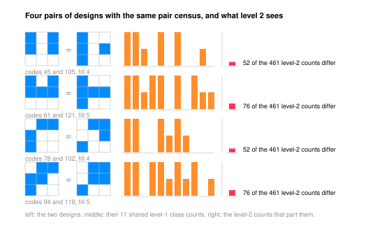

# The Spin Spectrum Reads a Pair Census

<picture><source media="(prefers-color-scheme: dark)" srcset="figures/avatar-dark.png"></picture>

Spin a black-and-white picture about its centre and record how much of it survives at each order of rotational symmetry. That list of numbers looks like a transform, but for a picture drawn as equal square cells on a square raster it is not: every order of the list is one fixed linear function of a single table of integers, the number of filled cell pairs of each shape, two pairs having the same shape when a symmetry of the square carries one to the other. Two pictures with the same table have the same list at every order, at every resolution and under every truncation, exactly, with no transform run.

**Theorem.** For a $0/1$ indicator $f = \sum_j x_j \mathbf{1}_{C_j}$ on the cells of a square raster, $P_m(f) = \sum_{j,k} x_j x_k Q_m[j,k]$ with $Q_m[j,k] = \int \mathrm{Re}(g_{m,j}\overline{g_{m,k}}) \, 2\pi r \, dr$, and $Q_m$ is constant on the orbits of the raster's symmetry group acting on pairs of cells. So $P_m$ is a linear functional of the pair census, and equal censuses force equal spectra at every order.

At base three and one level of refinement the census has eleven entries, the designs fall into $101$ symmetry classes, and the census takes only $97$ values: four pairs of genuinely different designs are homometric, and the paper exhibits them with their spectra shown identical at that level. Two geometric identities, a pair of cells whose rings overlap at a single radius and nowhere else and the raster's similarity to its own centre cell, pin the rank of the spectrum at nine of the eleven entries, split as six even orders and three odd, and the thirteen lowest orders attain every bound. Read one level finer the spectrum separates all $101$ classes with the two closest still three percent apart, so the homometry is a level-one fact and the spectrum is a complete invariant of the symmetry class, and the credit belongs to the census.

- Grew from the [spin](https://github.com/mrlyprod/mrlyprod/blob/main/research/spin.md) page of the MrlyMath tree.
- [paper.pdf](paper.pdf) - the paper.
- `tectonic paper.tex` rebuilds it; `python3 scripts/verify.py` runs all eleven checks in about two seconds, four of them in exact integer arithmetic and the rest against a tanh-sinh quadrature whose agreement with a finer rule is printed beside every number; `python3 scripts/figure.py` redraws the figure and re-checks the class tables behind it.
