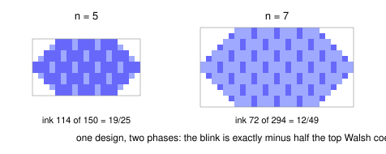

# The Walsh Spectrometer: Exact Diagonal-Slice Ink for Every Three-Dimensional Parity Design

Take a cube of graph paper `4n` cells on a side, chop each axis into blocks of four, and give every cell three bits: is its x-block even or odd, its y-block, its z-block. A *design* is a decision about those eight bit-triples, ink or paper, so there are exactly 256 designs. Cut the cube with the slanted plane `x + y + z = 6n - 2`, keep the cells with `z` even, and you get a hexagon of exactly `6n^2` cells. What fraction of the hexagon is inked? This paper answers that for all 256 designs at once, exactly, with no fit and no error term - and the answer's coefficients turn out to be the design's Walsh-Fourier spectrum, level by level. Point the layer stack at a design and it prints the design's spectrum, which is why we call it a spectrometer.

A design is a subset $D \subseteq \{0,1\}^3$ with indicator $f_D$. Its Walsh coefficients are $F_D(S) = \frac{1}{8}\sum_x f_D(x)(-1)^{x \cdot S}$, and $\Sigma_j = \sum_{|S|=j} F_D(S)$ is the level-$j$ sum. Write $s = (-1)^{(3n-1)/2}$, which is $-1$ when $n \equiv 1 \pmod 4$ and $+1$ when $n \equiv 3 \pmod 4$. The ink is the inked fraction of the $6n^2$ cells.

**Theorem.** For every design and every odd $n \ge 1$,

$$\mathrm{ink}_D(n) = \Sigma_0 - \tfrac12 \Sigma_3 s + \frac{\tfrac23 \Sigma_1 - \tfrac13 \Sigma_2 s}{n} + \frac{\tfrac23 \Sigma_2 - (\tfrac13 \Sigma_1 + \tfrac12 \Sigma_3)s}{n^2}.$$

The background is the mean Walsh coefficient, the two-step blink is minus half the top one, and the $1/n$ orders read the two middle levels, pairing level $j$ against level $3-j$ - with the top level riding along once more in the last term.

The engine is a counting theorem: the eight macro-parity populations of the slice depend only on the weight of the parity vector, and are four quadratic quasipolynomials with two constituents each, selected by $n \bmod 4$. At $n = 9$ they are $(114, 32, 84, 24)$. That quasipolynomiality is what Ehrhart's theorem predicts; the closed forms, the weight-only dependence, and the spectral pairing are the content. The scripts re-check all of it: three independent routes to the counts for every odd $n \le 55$, a fourth interval-counting route at $n = 101, 555, 999, 9991$, and the ink law in exact rational arithmetic for all 256 designs at all 32 of those sizes, zero mismatches. The general law also reproduces the four previously known family laws exactly - carpet, net, tree and void, at codes 23, 232, 3 and 129.

- [paper.pdf](paper.pdf) - the paper.
- `tectonic paper.tex` rebuilds it; `python3 scripts/verify.py` re-checks every number; `python3 scripts/figure.py` redraws the two slices.
