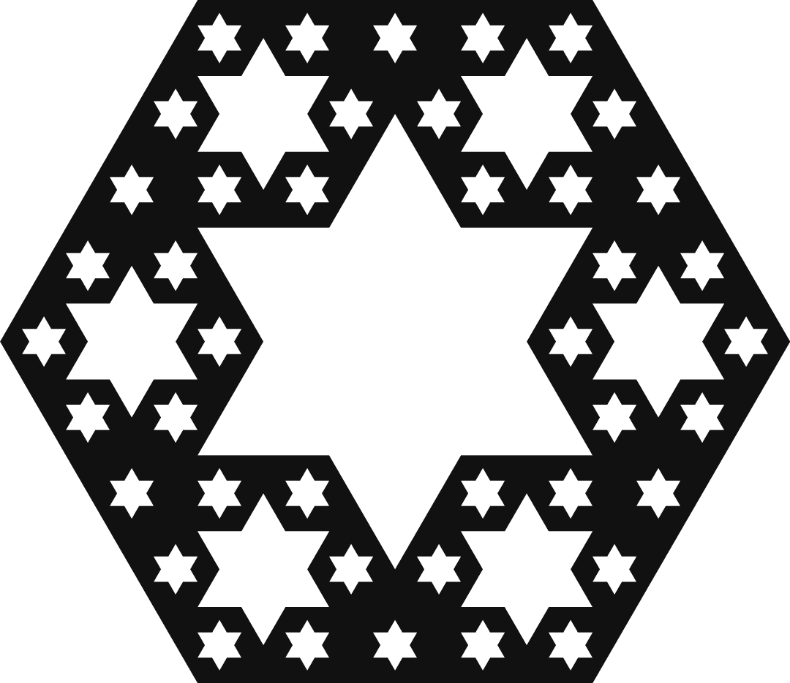
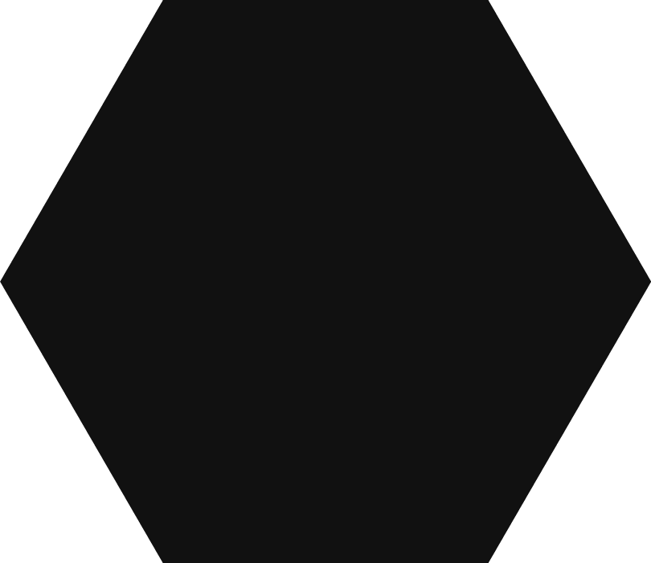
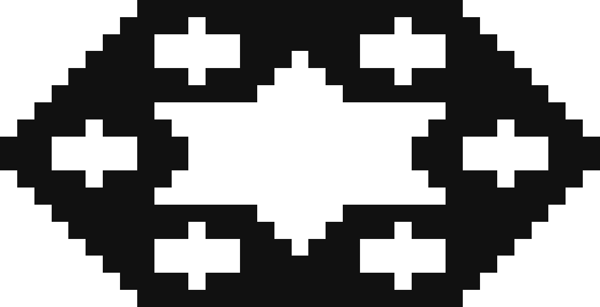
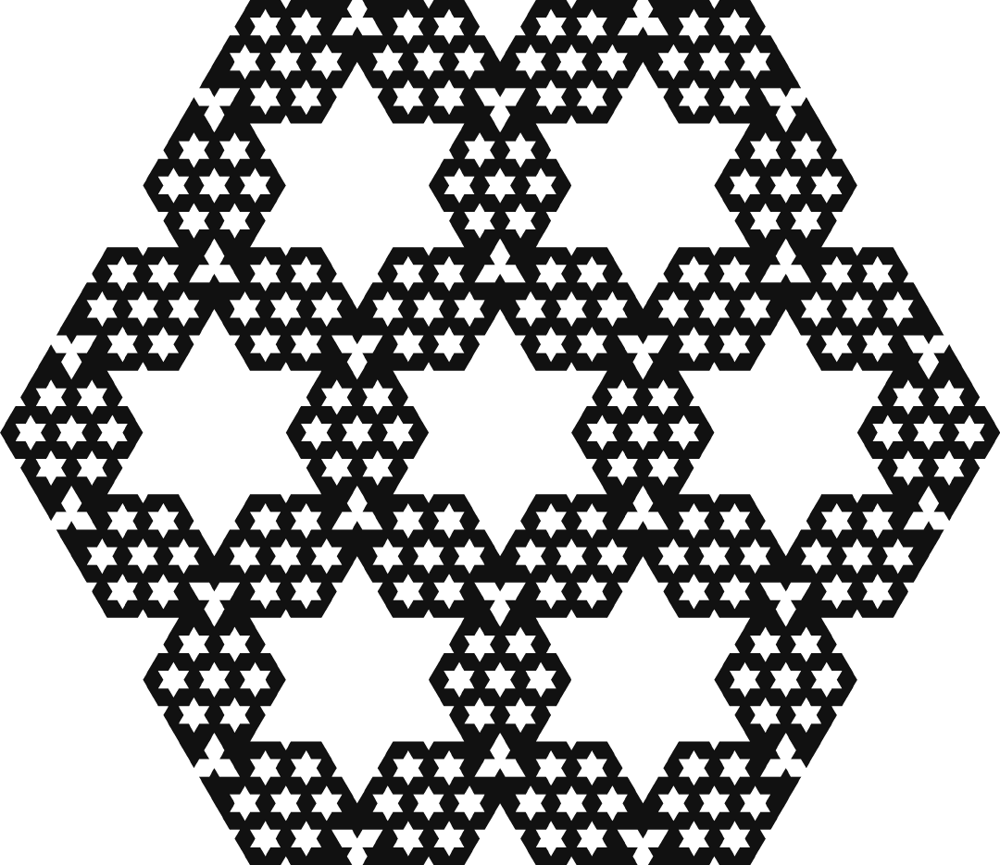
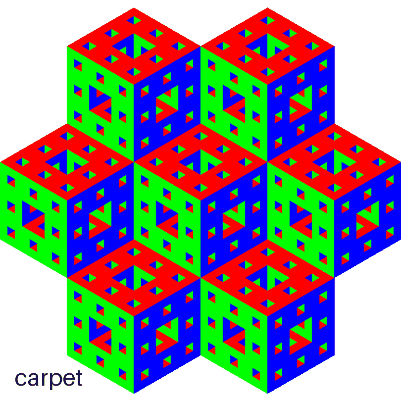
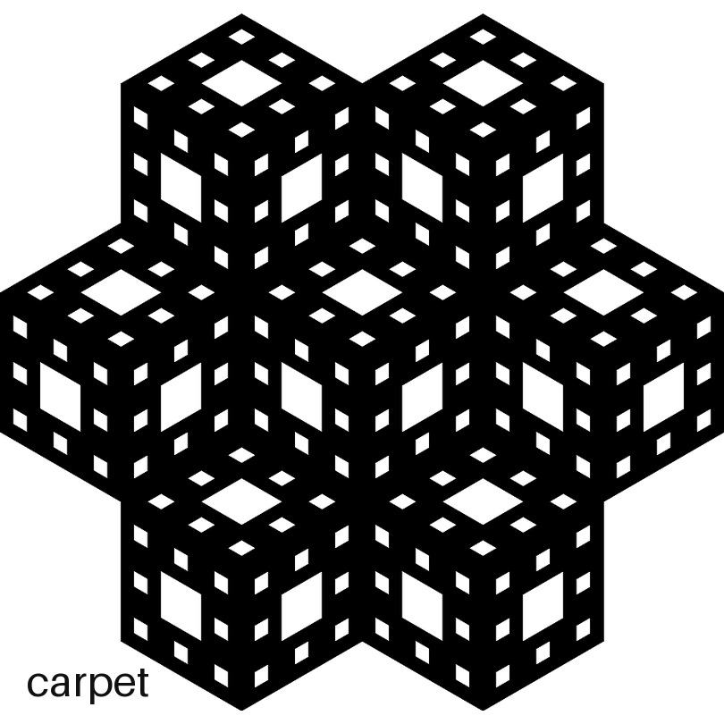
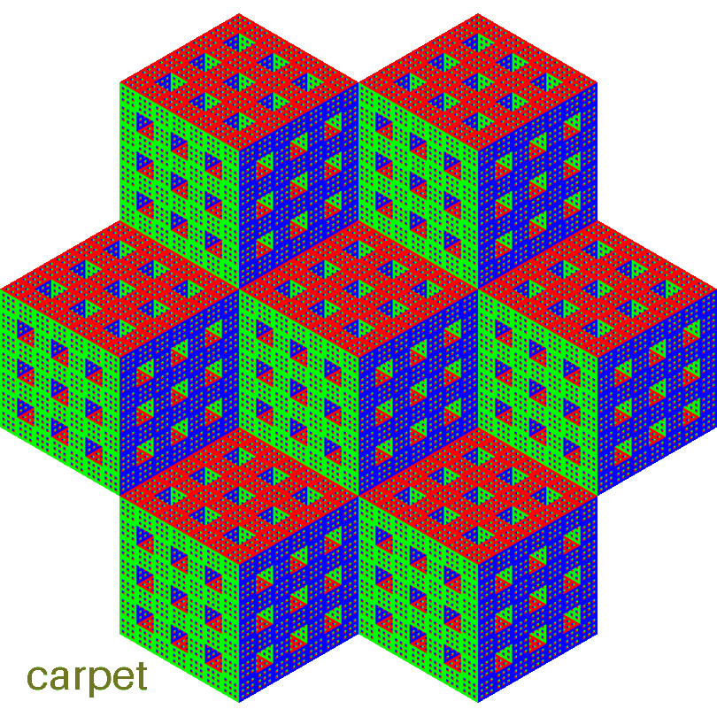
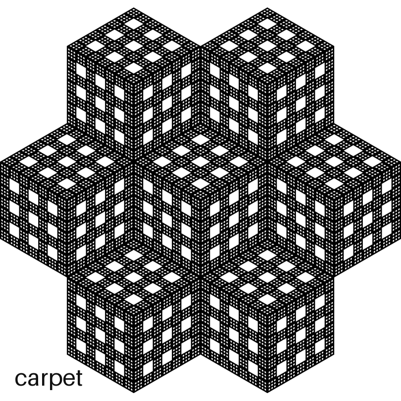

# Slice a Sponge, Get Snowflakes

*a generalized Menger sponge slice*

Welcome to the wonderful world of MrlyMath! Let's slice some 3D fractal sponges into 2D grids of 1s and 0s, then render triangles and make pretty snowflakes!

*Up top: the cut of the number-5 sponge at level 2 — black is fill, white is void, and the rainbow is the rest of the triangular lattice, colored at random.*

## The Cut

Cut a cube straight through its center, corner to opposite corner, and the face you reveal is a perfect hexagon. Do the same to a Menger sponge (cube with lots of holes in it) and the hexagon fills with six-pointed stars. Build sponges on other numbers and the cut shatters into shapes that look a bit like snowflakes.



A cube with a six-sided face? Sounds wrong, no?

## Start with a cube, take a bite, go deeper



Slice perpendicular to the long diagonal and the blade crosses six of the twelve edges, each at its midpoint, all the same distance from the center... a regular hexagon. Now take a bite: the 3×3×3 sponge is missing 7 of its 27 cubes, so the blade opens a hexagonal hole through the missing center, then clips a wedge off each of the six missing face cubes. Hole plus six wedges... a star! Now go deeper: every solid cube is itself a smaller sponge, so each survivor adds its own star — smaller and smaller, forever. It's fractal!

This base cut is not mine and deserves full credit: Sébastien Pérez-Duarte rendered the diagonal slice first, and George Hart made a lovely video about why the stars appear, both linked below. Everything past the classic Menger slice — the other numbers, the raster algorithm, the families — is the new stuff.

## Change the number


Nothing in the rule cares about 3. Keep at most one odd digit in any odd base and the same knife works: 5, 7 and 9 each build their own sponge and their own cut. At 5 the cut shatters into separate snowflakes; at 9 it's a whole constellation of them. Same little test, one number changed!

## How the pictures are made

The recipe: take the 3D matrix, blow it up by 4, slice it into a 2D grid, then draw triangles up, down, up, down. That's it... now slowly.

The matrix is the sponge: 1 where a little cube survives, 0 where one was drilled out. One test decides the lot — keep a cube when at most one of x, y, z has an odd digit, at every base-b digit position. You've already seen this test in 2D: keep a square when at most one of x, y has an odd digit, and base 5 draws the MrlyProd logo —

```
11111
10101
11111
10101
11111
```

Add a third axis and the same test carves the sponge.

Why blow up? At full size the plane would only graze the corners of the little cubes. Split each into 4×4×4 and it passes cleanly through the middle, dissolving every survivor into about six triangles — half up, half down, a tiny hexagon. And why 4, not 2? Try it: at 2×2×2 every row of the slice comes out even — no middle triangle, no mirror spine — and far too coarse for the stars. Four is the smallest blow-up where every row lands odd, with a proper center. The plane keeps the cells where x + y + z = k, so layer z gives the line x + y = k − z. Stack the lines and that's the array. Notice what the blow-up really is: the sponge being rasterized. And that ugly raster turns out to be the literally perfect 2D array definition of these sponges.


Watch the raw arrays cycle through the numbers: the snowflakes are already there, in pure pixels, before a single triangle is drawn.

Both halves live in the archive: `mrlycore.rules.carpet` is the test, `mrlysix.geometry.cut` is the slice — the very function Gemini wrote, waiting below.

| the data drawn as squares | the same data drawn as triangles |
| --- | --- |
|  |  |

Squashed and jagged, no? That's because the cells were never squares: the diagonal plane of a cubic lattice is a triangular lattice. Draw the same array as triangles, point-up, point-down along each row, and the hexagon snaps into shape.

## Origins


Once upon a time, I was trying to find a way to slice my sponges. I had some 3D models lying around in Shapr3D so I took some screenshots. Then I went over to Photoshop and painstakingly overlaid a triangular lattice on top of each one. Then the fun began. I looped over every triangle with my eyes and wrote down its cell type: fill (1), void (0) or grid (-). I now had 5 text blobs in a TXT file: my sponges, sliced in a ternary fashion. The number after each row is its length in cells.

```txt
MrlyGram1 (simple cube)
---
111 (3)
111 (3)
---

MrlyGram3 (Menger Sponge)
-----------
--1111111-- (7)
-111101111- (9)
11100000111 (11)
11100000111 (11)
-111101111- (9)
--1111111-- (7)
-----------

MrlyGram5
-------------------
----11110001111---- (11)
---1111100011111--- (13)
--000100000001000-- (15)
-10000000100000001- (17)
1111000111110001111 (19)
1111000111110001111 (19)
-10000000100000001- (17)
--000100000001000-- (15)
---1111100011111--- (13)
----11110001111---- (11)
-------------------

MrlyGram7
---------------------------
------111111101111111------ (15)
-----11110111111101111----- (17)
----1110000011100000111---- (19)
---011100000111000001110--- (21)
--11111110111111101111111-- (23)
-1111011111110111111101111- (25)
111000001110000011100000111 (27)
111000001110000011100000111 (27)
-1111011111110111111101111- (25)
--11111110111111101111111-- (23)
---011100000111000001110--- (21)
----1110000011100000111---- (19)
-----11110111111101111----- (17)
------111111101111111------ (15)
---------------------------

MrlyGram9
-----------------------------------
--------1111000111110001111-------- (19)
-------111110001111100011111------- (21)
------00010000000100000001000------ (23)
-----1000000010000000100000001----- (25)
----111100011111000111110001111---- (27)
---11111000111110001111100011111--- (29)
--0001000000010000000100000001000-- (31)
-100000001000000010000000100000001- (33)
11110001111100011111000111110001111 (35)
11110001111100011111000111110001111 (35)
-100000001000000010000000100000001- (33)
--0001000000010000000100000001000-- (31)
---11111000111110001111100011111--- (29)
----111100011111000111110001111---- (27)
-----1000000010000000100000001----- (25)
------00010000000100000001000------ (23)
-------111110001111100011111------- (21)
--------1111000111110001111-------- (19)
-----------------------------------

MrlyGram11
-------------------------------------------
----------11111110111111101111111---------- (23)
---------1111011111110111111101111--------- (25)
--------111000001110000011100000111-------- (27)
-------01110000011100000111000001110------- (29)
------1111111011111110111111101111111------ (31)
-----111101111111011111110111111101111----- (33)
----11100000111000001110000011100000111---- (35)
---0111000001110000011100000111000001110--- (37)
--111111101111111011111110111111101111111-- (39)
-11110111111101111111011111110111111101111- (41)
1110000011100000111000001110000011100000111 (43)
1110000011100000111000001110000011100000111 (43)
-11110111111101111111011111110111111101111- (41)
--111111101111111011111110111111101111111-- (39)
---0111000001110000011100000111000001110--- (37)
----11100000111000001110000011100000111---- (35)
-----111101111111011111110111111101111----- (33)
------1111111011111110111111101111111------ (31)
-------01110000011100000111000001110------- (29)
--------111000001110000011100000111-------- (27)
---------1111011111110111111101111--------- (25)
----------11111110111111101111111---------- (23)
-------------------------------------------

MrlyGram13
---------------------------------------------------
------------111100011111000111110001111------------ (27)
-----------11111000111110001111100011111----------- (29)
----------0001000000010000000100000001000---------- (31)
---------100000001000000010000000100000001--------- (33)
--------11110001111100011111000111110001111-------- (35)
-------1111100011111000111110001111100011111------- (37)
------000100000001000000010000000100000001000------ (39)
-----10000000100000001000000010000000100000001----- (41)
----1111000111110001111100011111000111110001111---- (43)
---111110001111100011111000111110001111100011111--- (45)
--00010000000100000001000000010000000100000001000-- (47)
-1000000010000000100000001000000010000000100000001- (49)
111100011111000111110001111100011111000111110001111 (51)
111100011111000111110001111100011111000111110001111 (51)
-1000000010000000100000001000000010000000100000001- (49)
--00010000000100000001000000010000000100000001000-- (47)
---111110001111100011111000111110001111100011111--- (45)
----1111000111110001111100011111000111110001111---- (43)
-----10000000100000001000000010000000100000001----- (41)
------000100000001000000010000000100000001000------ (39)
-------1111100011111000111110001111100011111------- (37)
--------11110001111100011111000111110001111-------- (35)
---------100000001000000010000000100000001--------- (33)
----------0001000000010000000100000001000---------- (31)
-----------11111000111110001111100011111----------- (29)
------------111100011111000111110001111------------ (27)
---------------------------------------------------

...
```

Notice there are actually three types of cells, so I stored my slices in ternary.

```
VOID = 0
FILL = 1
GRID = -
```

Draw a triangle for every cell — up, down, up, down, including the invisible GRID cells — and the gram appears!

## CHALLENGE

Find an algorithm that will output the above sequence of slices. Then, loop over every cell and draw a square or better yet, a triangle!

The convention: 1 is material, 0 is hole. The level-1 slices ship in [files/](files/) as `cut-N-1.txt`, so you can check your answers.

Stop here and come back when you're done. Eye candy...



## SOLUTION

Around March 2025, after about a week of staring at 1s and 0s, I found a very pretty algorithm. It only works for Level 1s, but it works. I wrote it myself, and I'm quite proud of it.

How does it work? I'm not sure. But this specific family of fractals seems to have a unique repeating code (a, b, c, d) and somehow you can loop over them and paste them and then you get the top half and then you need to copy/paste then reverse/flip the bottom. The centers alternate fill, void, fill, void as the number climbs; the final translate takes care of that.

Find it here: `solution/formula.py`

```python
FLIP = str.maketrans("01", "10")

def binary_mrlygram(number: int):
    a = "0"
    b = "101"
    c = "11111"
    d = "0011100"
    rows = number
    bottom = []
    cursor = 0
    for index in range(rows):
        cursor = cursor % 8 + 1
        match cursor:
            case 1 | 8:
                center = a
                alternate = d
            case 2 | 7:
                center = b
                alternate = c
            case 3 | 6:
                center = c
                alternate = b
            case 4 | 5:
                center = d
                alternate = a
        binary = center
        target = 4 * number - 1 - (2 * index)
        while len(binary) < target:
            binary = alternate + binary + alternate
            binary = center + binary + center
        while len(binary) != target:
            binary = binary[1:-1]
        bottom.append(binary)
    top = bottom.copy()
    top.reverse()
    binary = top + bottom
    if number % 4 == 1:
        binary = [row.translate(FLIP) for row in binary]
    return binary
```

If you participated in the challenge, is this also what you found? I'd love to know! Send your solution to the email on [my GitHub profile](https://github.com/carlomitchener).

## Python with Gemini

A couple months later I asked Gemini 2.5 Pro for a generalized algorithm that could slice any of my sponges. It failed miserably! But then I gave it the algorithm above and it kept testing and testing and well to my surprise, it succeeded. Disclaimer: I don't even understand this...

```python
# Cell3d is a fancy 3D matrix object
# Cell6d is a fancy 2D matrix object

def cut(cell: Cell3d):
    from .models import Cell6d
    if not is_cube(cell):
        raise MrlyError("Cell must be a cube.")
    scale = 4
    grid = cell.types
    block = np.ones((scale, scale, scale), dtype=np.uint8)
    grid = np.kron(grid, block).astype(np.uint8)
    size = grid.shape[0]
    k = (3 * (size - 1)) // 2
    rows = []
    for z in range(0, size, 2):
        target = k - z
        min_x = max(0, target - (size - 1))
        max_x = min(size - 1, target)
        if min_x > max_x:
            continue
        row_bits = []
        for x in range(min_x, max_x + 1):
            y = target - x
            val = grid[x, y, z]
            row_bits.append(str(val))
        rows.append("".join(row_bits))
    if not rows:
        return Cell6d(cell=Cell2d(width=1, height=1), projection="cut", orientation="horizontal", start=0)
    width = max(len(row) for row in rows)
    height = len(rows)
    types = np.full((height, width), GRID, dtype=np.uint8)
    for r, row in enumerate(rows):
        padding_total = width - len(row)
        offset = padding_total // 2
        for c, char in enumerate(row):
            if char == '1':
                types[r, c + offset] = FILL
            elif char == '0':
                types[r, c + offset] = VOID
    return Cell6d(cell=Cell2d(types=types), projection="cut", orientation="horizontal", start=0)
```

## Rust with Claude

And now, with Claude, we've grown up a bit and re-written everything in Rust. The full MrlyMath source currently lives at [mrlyprod/mrlyprod](https://github.com/mrlyprod/mrlyprod/blob/main/pkgs/rs/mrlymath/src/six/geometry.rs) — and a frozen Python copy ships in this repo's [archive/](../archive/), which is what the scripts here actually run.

A quick overview of what it can do... every sponge cuts three ways:

- **iso** — the whole sponge, seen isometrically
- **pro** — the three faces the sponge shows you
- **cut** — the diagonal slice through the middle

and each way animates the four families, one frame each, labeled in the corner:

- **carpet** — keep a cell when at most one axis is odd (the sponges above)
- **net** — keep when all axes are odd, or all but one
- **tree** — keep when the chosen axes are even
- **void** — keep when every axis has the same parity

All at level 2, tessellated radially. Numbers down the side, cuts across the top.

|  | iso | pro | cut |
| --- | --- | --- | --- |
| **3** |  |  |  |
| **5** |  |  |  |
| **7** |  |  |  |

Run `python3 showcase.py` for the console, `showcase.py all` to draw every cell above, or `showcase.py cut 5` for just one.

## Make a Snowflake

Ready to get your hands... snowy?

The sponge, the slice and the renderers all live in `mrlysix`, inside this repo's [archive/](../archive/) — clone the repo and everything is already next door:

```bash
git clone https://github.com/carlomitchener/carlomitchener
cd carlomitchener/some26
pip install pillow numpy
python3 cut.py sweep
```

The sweep redraws every snowflake in [files/](files/) — all the cut and grid pngs, svgs, txts and gifs — in about 3 seconds. Run `python3 cut.py` on its own for the console, or `cut.py draw 7 2` for a single snowflake. The showcase gifs come from `showcase.py`, and the rainbow hero up top from `image.py`.

Everything in `files/` was output by that algorithm.

Enjoy!

## Further reading

- Sébastien Pérez-Duarte, [*Slice of Menger*](https://flickr.com/photos/sbprzd/1432723128/) — the first render of the diagonal slice
- George Hart, [*Mathematical Impressions: The Surprising Menger Sponge Slice*](https://www.simonsfoundation.org/2012/12/10/mathematical-impressions-the-surprising-menger-sponge-slice/) — a lovely video on why the stars appear
- George Hart, [*Half a Menger Sponge with Hexagonal Cross-Section*](https://www.georgehart.com/rp/half-menger-sponge.html) — the cut, 3D-printed
- Rob Hocking, [*Three-Dimensional Diagonal Cross-Sections of Four-Dimensional Menger Sponges*](https://archive.bridgesmathart.org/2023/bridges2023-291.pdf) (Bridges 2023) — the slice, one dimension up
- Rob Hocking, [*Menger-Slice Inspired Fractals based on the Pentagon, Dodecahedron, and 120-Cell*](https://archive.bridgesmathart.org/2024/bridges2024-297.pdf) (Bridges 2024) — the slice idea on other solids
- Paul Bourke hosts a page on this very family: [*Mrly Fractals*](https://paulbourke.net/fractals/mrlymath) — renders, POV-Ray code and fractal dimensions for the 5- and 7-sponges

## Open questions

- What's the area formula?
- What's the perimeter formula?
- Is there a closed-form fill/void for any of the families?
- Or something more general for all of them?
- Is Pi (or some other constant) lurking around here?

## Extras

If you enjoy cellular automata, find us on Instagram or YouTube (@mrlyprod). I'm working on applying all this to cellular automata. A demo is already live: `archive/mrlydemos/game.py`

## The End

Thank you for reading. I now invite you to join me on my quest to discover...

*The Wonderful World of MrlyMath*