*This is my entry to the 2026 Summer of Math Exposition by 3Blue1Brown (https://some.3b1b.co)*

*Note: I am continuously polishing this page — code, images, wording and the occasional new find.*

*Tip for Desktop users: press the 'menu' icon in the top right corner of this viewer to open the outline view and reduce page width.*

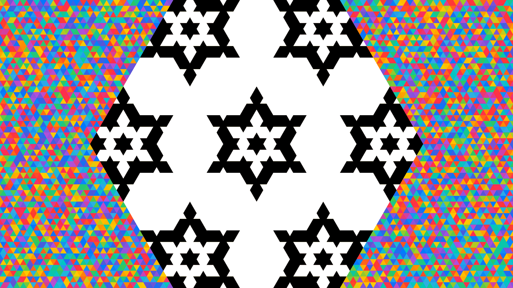

# Generalized Menger Sponge Slice

*Slice a Sponge, Get Snowflakes*

Here's a game you can play in your kitchen. Balance a cube of cheese on one of its corners, so the opposite corner points straight at the ceiling. Now slice it in half with one flat, level cut, right through the middle. Question: what shape is the new face you just revealed?

Think about it for a second. A square? A rectangle? Some kind of diamond?

And the better question: what happens if the cube is full of holes — a fractal sponge, tunnels drilled through tunnels, forever? Welcome to the wonderful world of MrlyMath! We're going to slice 3D fractal sponges into flat grids of 1s and 0s (plus one secret third symbol you'll meet later), draw those grids as triangles, and end up with snowflakes.

*Up top: the cut of the number-5 sponge at level 2 — black is fill, white is void, and the rainbow is the rest of the triangular lattice, colored at random.*

## The Cut

The answer... is a perfect hexagon. Six equal sides, cut out of a shape built entirely from squares.

Do the same to a Menger sponge — a cube drilled full of holes, in a very organized way — and the hexagon fills up with six-pointed stars. Build sponges on other numbers (you'll learn how in a minute) and the cut shatters into sparkling little snowflakes.

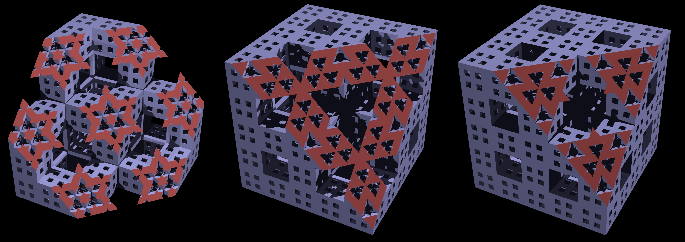

*Render by [Paul Bourke](https://paulbourke.net/fractals/mrlymath/)*

A cube with a six-sided face? Sounds wrong, no? Let's see why it's right.

## Start with a cube, take a bite, go deeper


**Start with a cube.** Balanced on a corner, the cube wears its twelve edges like a crown: three hug the bottom corner, three hug the top, and the other six zig-zag in a ring around the middle. A level blade through the exact center crosses precisely those six middle edges, each at its midpoint, all the same distance from the center... six identical crossings. A regular hexagon! (This is the *diagonal cut*: the blade runs perpendicular to the cube's long corner-to-corner diagonal.)

**Take a bite.** The 3×3×3 sponge is missing 7 of its 27 little cubes — the very center, plus the middle of each face. Quick, before you read on: how many of those seven does the blade actually touch? ...All of them. It sails through the missing center, opening a hexagonal hole, then clips a wedge off each of the six missing face cubes. Hole plus six wedges... a star!

**Go deeper.** Every little cube that survived is secretly a whole sponge of its own, so the blade plays the same trick inside each survivor, and every one adds its own smaller star — and inside those, smaller stars still, forever. That's all the word *fractal* means: a shape that keeps its own picture inside itself, at every zoom.

The classic cut is not my invention, and the credit goes where it's due: Sébastien Pérez-Duarte rendered the diagonal slice first, and George Hart made a lovely video about why the stars appear — both linked below. Everything past the classic Menger slice — the other numbers, the raster algorithm, the families, the counting — is the new stuff.

## Change the number


Time for the sponge's secret recipe. Chop the cube 3×3×3, like a Rubik's cube, and give every little cube an address (x, y, z) — three numbers, each 0, 1 or 2. The whole Menger sponge is now one sentence: **keep a cube when at most one of its three address numbers is odd.** The dead center is (1, 1, 1) — three odds — drilled out. A face middle like (1, 0, 1) — two odds — drilled out. An edge cube like (1, 0, 0) — one odd — safe. Repeat the game inside every survivor, forever, and the Menger sponge appears.

But look again: nothing in that sentence cares about 3. Chop 5×5×5 instead — addresses 0 to 4, same sentence — and out comes a brand-new sponge with a brand-new cut. 7 works. 9 works. Every odd number builds its own sponge, and the same knife slices them all: at 5 the cut shatters into separate snowflakes; at 9 it's a whole constellation of them. Same little test, one number changed!

## How the pictures are made

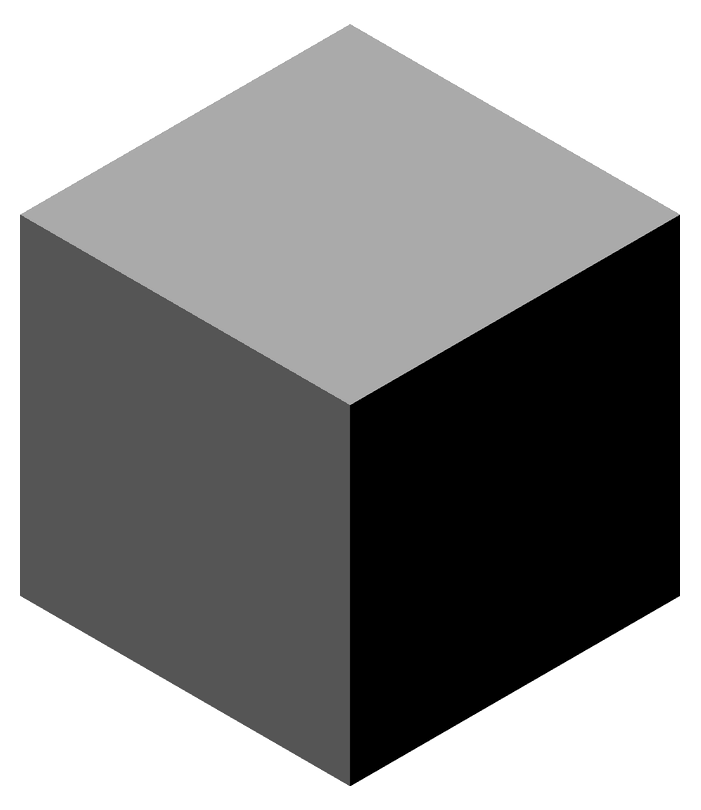

The recipe: take the 3D matrix, blow it up by 4, slice it into a 2D grid, then draw triangles up, down, up, down. That's it... now slowly.

The matrix is the sponge: 1 where a little cube survives, 0 where one was drilled out — all decided by the *at most one odd* test you just met. The test doesn't even need 3D. Keep a square when at most one of x, y is odd, and a 5×5 grid draws the MrlyProd logo —

```
11111
10101
11111
10101
11111
```

Add a third axis and the same test carves the sponge. Deeper levels hide one more trick: write each address in base *b* — base 5 for the 5-sponge — and run the odd-check on every digit separately. That's all "repeat inside each survivor" secretly means: level 1 checks one digit, level 2 checks two, level 3 checks three. Recursion is just digits!

Why blow up? Because at full size the plane would only graze the corners of the little cubes — each cube meets the blade at a single point, and a point makes a lousy pixel. Split every cube into 4×4×4 micro-cubes and the plane passes cleanly through the middle, dissolving each survivor into about six triangles — half pointing up, half pointing down, a tiny hexagon of its own.

And why 4, not 2? Try it: at 2×2×2 every row of the slice comes out even-length — no middle triangle, no mirror spine — far too coarse for the stars. Four is the smallest blow-up where every row lands odd, with a proper center.

The slicing itself is one line of arithmetic. The blade keeps the micro-cubes whose address adds up to a magic constant: x + y + z = k. Look at a single layer z and that's the straight line x + y = k − z. Stack the lines, layer by layer, and out drops the 2D array.

Notice what the blow-up really is: the sponge being *rasterized* — turned into pixels, like a photo. Except this raster isn't an approximation. Every cell is exactly fill or exactly void — and that ugly pixel-grid turns out to be the perfect 2D array definition of these sponges.


Watch the raw arrays cycle through the numbers: the snowflakes are already there, in pure pixels, before a single triangle is drawn.

| the data drawn as squares | the same data drawn as triangles |
| --- | --- |
|  | 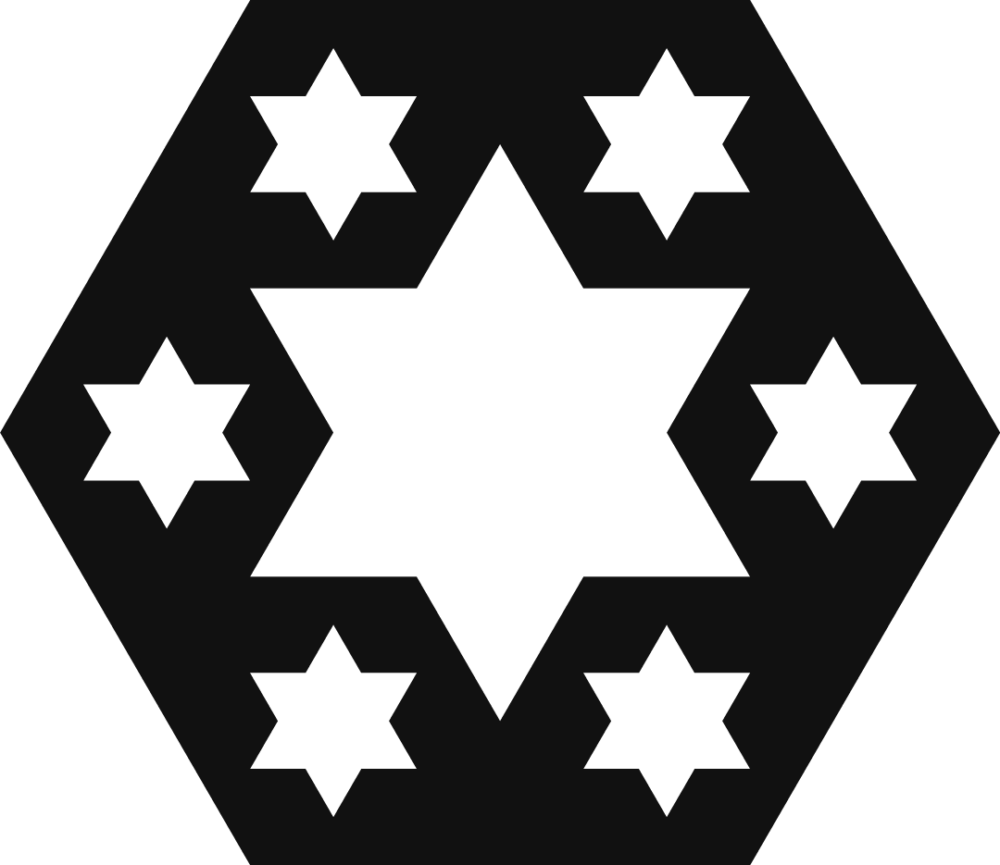 |

Squashed and jagged, no? That's because these cells were never squares. Cut diagonally through a stack of cubes and the pattern of crossings is not a square grid — it's a triangular one. Draw the very same array as triangles — point-up, point-down, point-up along each row — and the hexagon snaps into shape.

One more knob before we go. Flipping one value — `start`, whether the *first* triangle points up or down — sets the look of the whole picture, because every triangle after it simply alternates. It's also a common source of visual bugs: get it wrong and nothing crashes, every triangle just draws upside-down, and the snowflakes shatter into static. Here's the number-5 cut swapping between the two:

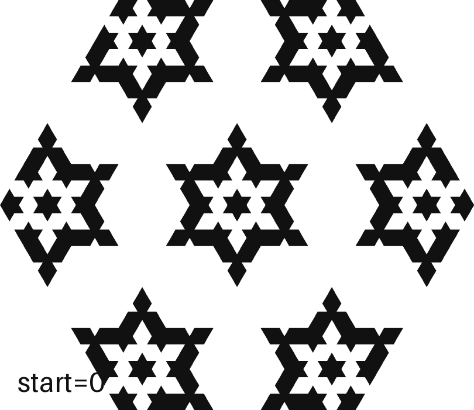

## Origins


Once upon a time, I was trying to find a way to slice my sponges — no formula, no algorithm, nothing but stubbornness. I had some 3D models lying around in Shapr3D, so I took some screenshots. Then I went over to Photoshop and painstakingly overlaid a triangular lattice on top of each one. Then the fun began: I looped over every triangle *with my eyes* and wrote down its cell type — fill (1), void (0) or grid (-). By the end I had six text blobs in a TXT file: my sponges, sliced by hand. The number after each row is its length in cells.

Before you scroll past the blobs, stare for a minute. Patterns are hiding everywhere: every row reads the same forwards and backwards; the top half is the bottom half flipped; the row lengths climb by 2, and the longest row appears twice. The snowflakes are in there, wearing digits.

```txt
MrlyGram1 (simple cube)
---
111 (3)
111 (3)
---

MrlyGram3 (Menger Sponge)
-----------
--1111111-- (7)
-111101111- (9)
11100000111 (11)
11100000111 (11)
-111101111- (9)
--1111111-- (7)
-----------

MrlyGram5
-------------------
----11110001111---- (11)
---1111100011111--- (13)
--000100000001000-- (15)
-10000000100000001- (17)
1111000111110001111 (19)
1111000111110001111 (19)
-10000000100000001- (17)
--000100000001000-- (15)
---1111100011111--- (13)
----11110001111---- (11)
-------------------

MrlyGram7
---------------------------
------111111101111111------ (15)
-----11110111111101111----- (17)
----1110000011100000111---- (19)
---011100000111000001110--- (21)
--11111110111111101111111-- (23)
-1111011111110111111101111- (25)
111000001110000011100000111 (27)
111000001110000011100000111 (27)
-1111011111110111111101111- (25)
--11111110111111101111111-- (23)
---011100000111000001110--- (21)
----1110000011100000111---- (19)
-----11110111111101111----- (17)
------111111101111111------ (15)
---------------------------

MrlyGram9
-----------------------------------
--------1111000111110001111-------- (19)
-------111110001111100011111------- (21)
------00010000000100000001000------ (23)
-----1000000010000000100000001----- (25)
----111100011111000111110001111---- (27)
---11111000111110001111100011111--- (29)
--0001000000010000000100000001000-- (31)
-100000001000000010000000100000001- (33)
11110001111100011111000111110001111 (35)
11110001111100011111000111110001111 (35)
-100000001000000010000000100000001- (33)
--0001000000010000000100000001000-- (31)
---11111000111110001111100011111--- (29)
----111100011111000111110001111---- (27)
-----1000000010000000100000001----- (25)
------00010000000100000001000------ (23)
-------111110001111100011111------- (21)
--------1111000111110001111-------- (19)
-----------------------------------

MrlyGram11
-------------------------------------------
----------11111110111111101111111---------- (23)
---------1111011111110111111101111--------- (25)
--------111000001110000011100000111-------- (27)
-------01110000011100000111000001110------- (29)
------1111111011111110111111101111111------ (31)
-----111101111111011111110111111101111----- (33)
----11100000111000001110000011100000111---- (35)
---0111000001110000011100000111000001110--- (37)
--111111101111111011111110111111101111111-- (39)
-11110111111101111111011111110111111101111- (41)
1110000011100000111000001110000011100000111 (43)
1110000011100000111000001110000011100000111 (43)
-11110111111101111111011111110111111101111- (41)
--111111101111111011111110111111101111111-- (39)
---0111000001110000011100000111000001110--- (37)
----11100000111000001110000011100000111---- (35)
-----111101111111011111110111111101111----- (33)
------1111111011111110111111101111111------ (31)
-------01110000011100000111000001110------- (29)
--------111000001110000011100000111-------- (27)
---------1111011111110111111101111--------- (25)
----------11111110111111101111111---------- (23)
-------------------------------------------

...
```

And there it is — the promised secret third symbol! Fill and void make the snowflake; the `-` cells are the empty lattice around it, padding the short rows out to a neat block. Three symbols instead of two means the slices are stored in *ternary*, not binary.

```
VOID = 0
FILL = 1
GRID = -
```

Draw a triangle for every cell — up, down, up, down, including the invisible GRID cells — and the gram appears! (*Gram* — as in MrlyGram — is the house name for these snowflake pictures.)

## The Challenge

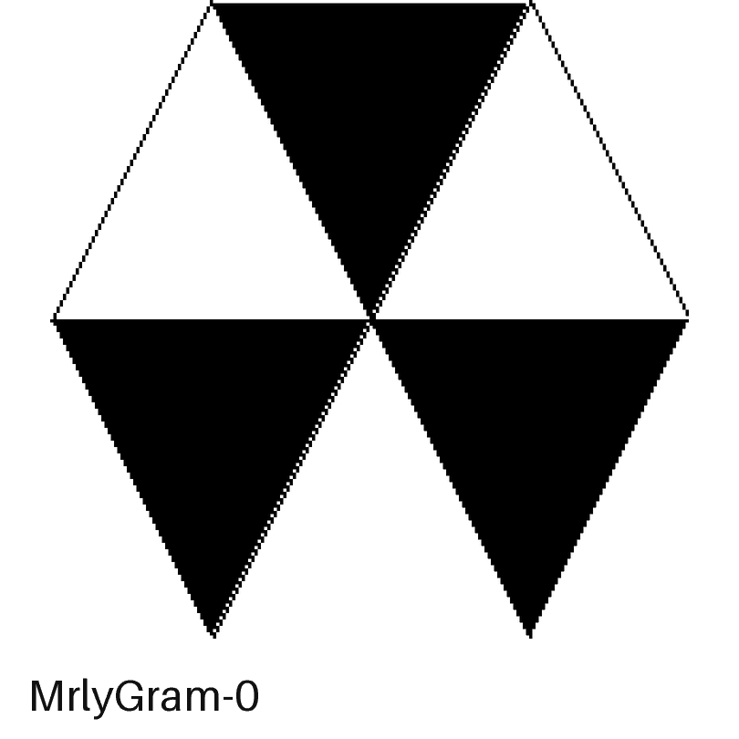

Your turn! Find an algorithm — a program, or just a pencil-and-paper recipe — that outputs the slices above for any odd number, straight from the number. No 3D sponge, no slicing: the raster method from earlier counts as a warm-up, but the real game is to stay flat. Then loop over every cell and draw a square or, better yet, a triangle!

The stills above live in [files/old/images/](files/old/images/).

The convention: 1 is material, 0 is hole. The level-1 slices ship in [files/cuts/](files/cuts/) as `cut-N-1.txt`, so you can check your answers.

**Bonus round:** count the cells, too. How many fills, how many voids, how many grids, and how many triangles all together? The total drops out in a single line once you spot what shape you're looking at. The fill/void split is the hard one — can you get it straight from the number, with no drawing at all?

This is a real stop-and-think moment, the best kind — I spent a happy week here. When you're happy, view the [SOLUTION.md](SOLUTION.md).

## Python with Gemini

A couple months later I asked Gemini 2.5 Pro for a generalized algorithm that could slice any of my sponges, at any level. It failed miserably! But then I gave it my level-1 formula from [SOLUTION.md](SOLUTION.md), and it kept testing and testing and, to my surprise, it succeeded. Full disclosure: I still don't entirely understand the code it wrote. The good news is I don't have to trust it, either — it reproduces every gram I ever transcribed by eye, digit for digit. The hand-typed blobs from Origins turned out to be the answer key.

```python
# Cell3d is a fancy 3D matrix object
# Cell6d is a fancy 2D matrix object

def cut(cell: Cell3d):
    from .models import Cell6d
    if not is_cube(cell):
        raise MrlyError("Cell must be a cube.")
    scale = 4
    grid = cell.types
    block = np.ones((scale, scale, scale), dtype=np.uint8)
    grid = np.kron(grid, block).astype(np.uint8)
    size = grid.shape[0]
    k = (3 * (size - 1)) // 2
    rows = []
    for z in range(0, size, 2):
        target = k - z
        min_x = max(0, target - (size - 1))
        max_x = min(size - 1, target)
        if min_x > max_x:
            continue
        row_bits = []
        for x in range(min_x, max_x + 1):
            y = target - x
            val = grid[x, y, z]
            row_bits.append(str(val))
        rows.append("".join(row_bits))
    if not rows:
        return Cell6d(cell=Cell2d(width=1, height=1), projection="cut", orientation="horizontal", start=0)
    width = max(len(row) for row in rows)
    height = len(rows)
    types = np.full((height, width), GRID, dtype=np.uint8)
    for r, row in enumerate(rows):
        padding_total = width - len(row)
        offset = padding_total // 2
        for c, char in enumerate(row):
            if char == '1':
                types[r, c + offset] = FILL
            elif char == '0':
                types[r, c + offset] = VOID
    return Cell6d(cell=Cell2d(types=types), projection="cut", orientation="horizontal", start=0)
```

## Rust with Claude

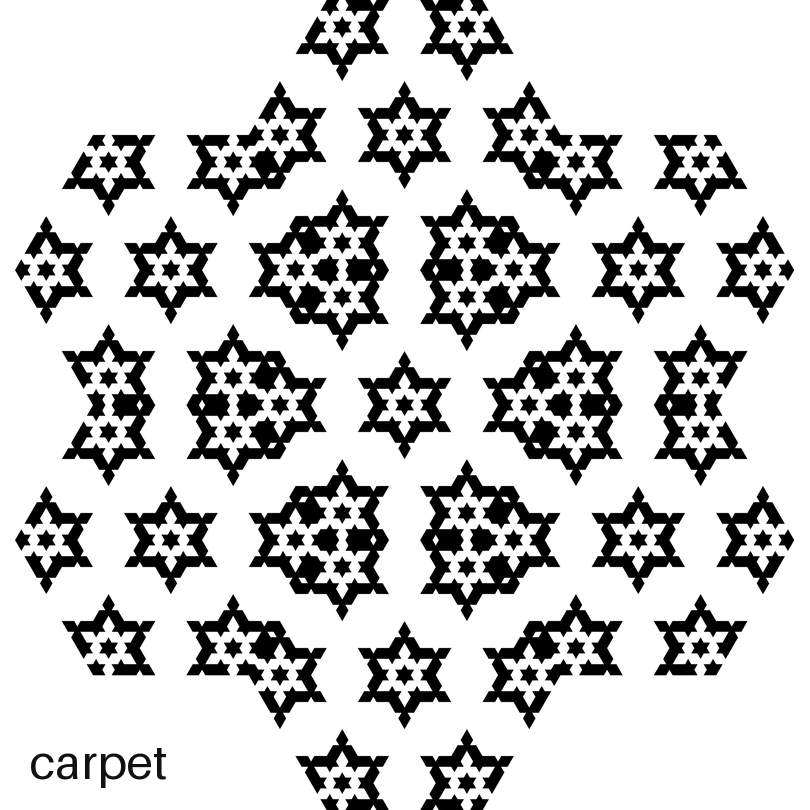

And now, with Claude, we've grown up a bit and rewritten everything in Rust. Along the way the one rule grew three siblings — *net*, *tree* and *void* — four families of sponges in all. The full MrlyMath source currently lives at [mrlyprod/mrlyprod](https://github.com/mrlyprod/mrlyprod/blob/main/pkgs/rs/mrlymath/src/six/geometry.rs) — and a frozen Python copy ships in this repo's [mrlypy/](../mrlypy/), which is what the scripts here actually run.

For a tour of all four families, see [SHOWCASE.md](SHOWCASE.md).

## The Bonus Solution

Did you count them? Now that we can build any gram at any level, let's see what's hiding in there.

Start with the easy part. The grid cells are packing foam — never part of the picture. Drop them and what's left is the hexagon. And here's the nice bit: a hexagon of side *k* is just six equilateral triangles glued around a point, and a triangle of side *k* holds exactly *k*² little cells — count its rows: 1 + 3 + 5 + 7... the odd numbers stack up into a perfect square! So the hexagon holds 6*k*² triangles, our hexagon always has side *number*^*level*, and the total is locked in before you draw a thing:

```
fill + void = 6 × number^(2 × level)
```

Every number, every level. MrlyGram5 has 6 × 5² = 150 triangles; at level 2 it has 6 × 25² = 3750, however shattered it looks.

| number | fill | void | grid | total |
| --- | --- | --- | --- | --- |
| 1 | 6 | 0 | 0 | 6 |
| 3 | 42 | 12 | 12 | 54 |
| 5 | 72 | 78 | 40 | 150 |
| 7 | 204 | 90 | 84 | 294 |
| 9 | 210 | 276 | 144 | 486 |
| 11 | 486 | 240 | 220 | 726 |
| 13 | 420 | 594 | 312 | 1014 |
| 15 | 888 | 462 | 420 | 1350 |
| 17 | 702 | 1032 | 544 | 1734 |
| 19 | 1410 | 756 | 684 | 2166 |

That's level 1, and the grid column is always 2*n*(*n*−1). Now watch the fill column: it doesn't just climb. Number 11 packs more material (486) than number 13 (420), and 15 (888) beats 17 (702). The odd numbers leapfrog each other. Keep that in your pocket — it's a clue.

### Everything divides by six

Every fill and every void in that table is a multiple of 6. That's not luck. Spin a gram by 60° — one sixth of a full turn — and it lands exactly back on itself. And here's the sneaky part: the center of the hexagon is a *corner* of the lattice, not the middle of a triangle, so during the spin no cell gets to sit still. Every triangle marches around in a ring of six, no stragglers — so everything comes in sixes.

Which means you can divide by six and count just one 60° pizza slice instead:

| number | fill/6 | void/6 | total/6 |
| --- | --- | --- | --- |
| 1 | 1 | 0 | 1 |
| 3 | 7 | 2 | 9 |
| 5 | 12 | 13 | 25 |
| 7 | 34 | 15 | 49 |
| 9 | 35 | 46 | 81 |
| 11 | 81 | 40 | 121 |
| 13 | 70 | 99 | 169 |
| 15 | 148 | 77 | 225 |
| 17 | 117 | 172 | 289 |
| 19 | 235 | 126 | 361 |

That last column is *number*², of course — and at any level it's *number*^(2 × *level*), which is exactly the number of squares in the flat 2D grid (the *flat* view in `SHOWCASE.md`) at the same number and level. One wedge of the snowflake and one whole carpet hold the same count!

### A formula, finally

"Is there a closed-form fill/void?" sat in my open questions for a long while. (A closed form is a formula you plug the number straight into — no drawing, no counting, the answer just falls out.) For level 1, here it is at last — two branches, split by the remainder when you divide the number by 4:

| number | fill | void |
| --- | --- | --- |
| even | 3*n*² | 3*n*² |
| 1, 5, 9, 13, … | 3(3*n*+1)(*n*+1)/4 | 3(5*n*+1)(*n*−1)/4 |
| 3, 7, 11, 15, … | 3(5*n*−1)(*n*+1)/4 | 3(3*n*−1)(*n*−1)/4 |

(The even row is a freebie: nothing stops the test on even numbers — their cut just splits exactly half-and-half.) The two odd rows are mirrors of each other: swap the 3 and the 5, swap the +1 and the −1. And that leapfrog from before? Just the two branches climbing at different speeds, taking turns in front.

### Down the levels

Now hold the number still and climb the levels instead. Each fill count is built from the two counts before it — the same kind of rule that runs the Fibonacci numbers, just with bigger multipliers — and every number keeps its own rule forever:

| number | fill at level 1, 2, 3, 4 … | rule |
| --- | --- | --- |
| 3 | 42, 306, 2250, 16578, … | 9 × prev − 12 × the one before |
| 5 | 72, 1164, 17268, 262116, … | 11 × prev + 62 × the one before |
| 7 | 204, 6840, 228528, 7628256, … | 42 × prev − 288 × the one before |
| 9 | 210, 10038, 426594, 18900966, … | 28 × prev + 693 × the one before |

### One of these is already famous

The Menger row — 42, 306, 2250, 16578 — lives in the OEIS (the online encyclopedia where mathematicians file every integer sequence they meet) as [A299916](https://oeis.org/A299916), and there's a lovely twist waiting there. Albert Säfström noticed the very same numbers count the *star-shaped holes* in the slice, largest first: at level 3 there is 1 big star, 6 medium ones and 42 small ones. Holes instead of material — same sequence! They match because every new star costs exactly 12 triangles.

The other numbers weren't in the OEIS. They are now! The level-1 fills and voids of every odd sponge have just been filed as the twin sequences [A399018](https://oeis.org/A399018) (fill: 6, 42, 72, 204, 210, …) and [A399019](https://oeis.org/A399019) (void: 0, 12, 78, 90, 276, …) — two complementary snowflake counters, submitted from this very project, each carrying the closed forms above, a portrait of its grams, and a link back to this page. (They're fresh enough that you might still catch them wearing their *draft* badge.)

### OEIS A399018 - FILL - 6, 42, 72, 204, 210, …
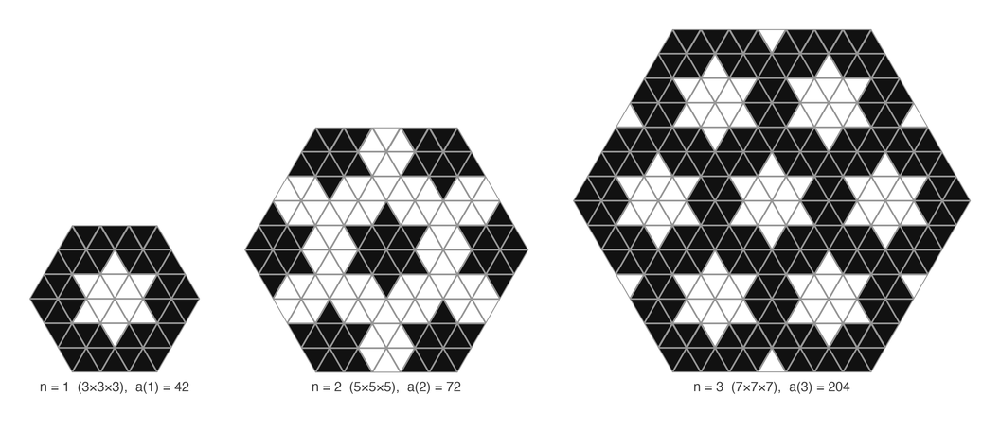

### OEIS A399019 - VOID - 0, 12, 78, 90, 276, …
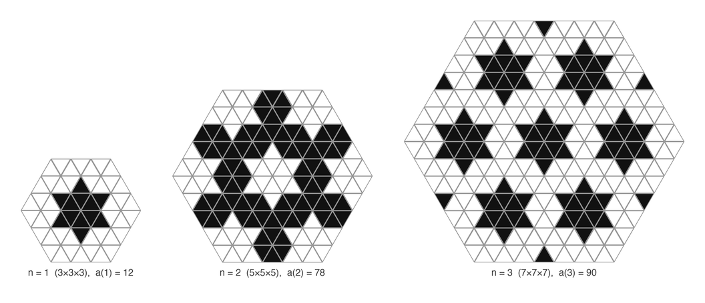

## Moiré

What happens when you stack them on top of each other? ...Something nobody drew.

Take every odd number from 1 to 55, slice each sponge, blow all twenty-eight grams up to exactly the same size, and lay them down like sheets of tracing paper — each one faint enough that no single number gets to win.

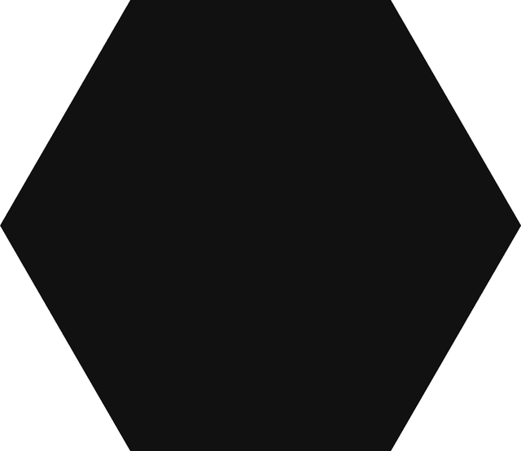

Watch it build. The first few frames are still recognizable snowflakes. Then somewhere past twenty the individual grams dissolve, and a picture surfaces that was in none of them: long straight rays crossing the whole hexagon, a ghost star at the middle, the six-fold symmetry still holding. That's *moiré* — the shimmer you get for free when you overlay grids of different pitch, the same one that ripples through two layers of net curtain, or across a photographed computer screen.

And it has to be there. Every gram is the same *at most one odd* test, just chopped finer: 1 unit across, then 3, then 5, all the way to 55. Their features land on top of each other wherever the numbers agree, and cancel wherever they don't — the bright and dark rays are a map of that agreement. Arithmetic, made visible by nothing more cunning than stacking.

The same trick works one dimension down. Here are the flat 2D carpets — the square grids from *How the pictures are made* — stacked the same way:


Squares instead of triangles, so the rays run diagonally rather than at 60°, but it's the same phenomenon: the main diagonal comes out twice as bright as the field around it. And that *twice* is exact — keep stacking and the ratio settles at precisely 2. (Twice the white *paper* showing, to be exact.) Look again: the other diagonal is its pixel-perfect twin, because every gram reads the same forwards and backwards. The picture carries a bright X. And look at the very center. That one dot alternates fill, void, fill, void as the number climbs — the same *n* mod 4 flip that powers [the solution](SOLUTION.md) — so across twenty-eight numbers it settles at exactly 50/50: a perfect mid-gray pinprick at the heart of the picture.

How far can you push it? Further than you'd guess. The field between the rays does slowly gray out — barely slower than a pile of random patterns would, it turns out — but the rays themselves never dim: each one keeps its exact brightness forever and only grows thinner, so every layer you add makes the picture sharper, not blurrier. Pixels give out first: at 1080 across, somewhere past number 150 each cell is thinner than two pixels, and the finest grams quietly turn to fog. (Memory goes next — number 301 wants 1.7 GB just to hold its blown-up cube.)

Run it yourself with `MIN` and `MAX` at the top of `mrlypy/mrlydemos/mrlygram.py`:

```bash
uv run mrlypy/mrlydemos/mrlygram.py cut carpet     # the snowflakes, stacked
uv run mrlypy/mrlydemos/mrlygram.py flat carpet    # the 2D carpets, stacked
uv run mrlypy/mrlydemos/mrlygram.py sweep          # both views, all four families
```

### The stack answers back

Two of the open questions at the bottom of this page used to ask: *is Pi lurking around here? What about prime numbers?* We stacked, we measured, we proved — and the answers are stranger than the questions. The proofs are still being written up (link at the end), so for now, the headlines:

**Pi plays a magic trick.** Behind every brightness in these stacks sits a wave, and every wave carries a π. But measure anything you can actually *see* — how bright a ray is, how the diagonal compares to the field — and the π's cancel out, exactly, every time. Every visible strength is a plain fraction. So where does π survive? In the *ink budget*: track how much ink the whole picture uses as the layers pile up, subtract the obvious part, and what's left creeps toward numbers built from π — and from a rarer celebrity, *Catalan's constant*, a number so mysterious nobody has even proved it isn't secretly a fraction.

**The primes hide one dimension down.** Compare any two of the flat carpets. If their numbers share a factor, the pictures echo each other — 9 echoes 3, 15 echoes 5, always. If they share none, the two pictures have *exactly* nothing in common: knowing where one is black tells you nothing at all about the other. So an odd number is prime exactly when its carpet is a total stranger to every carpet that came before it. The snowflakes, wonderfully, refuse to obey — the slice bends this law into something new, and each snowflake secretly whispers to its *double* instead. Chasing that is a story of its own.

**And the brightest lines had no name.** The strongest lines crossing the stacked snowflake sit at the quarter marks of its width — an exact step in brightness, one eighth, that every single layer votes for.

**One last secret: recipes have fingerprints.** Our sponge comes from one little parity test, but in 3D there are exactly 256 such tests — a whole zoo of sponges. Stack the slices of any of them and the picture reads its recipe's fingerprint: some recipes *blink* as the number climbs (one layer mostly ink, the next mostly paper — you met this leapfrog in the bonus solution), some hold perfectly steady, and you can tell which is which straight from the recipe, before drawing a single triangle. The *void* family is the showstopper: its stack keeps a twelve-armed star and a jet-black center dot *forever*, while the carpet's ghost star slowly dissolves into the gray.

The proofs, the code, and the full hunt — run by teams of AI agents checking each other's work, refuting each other freely — will live at [mrly.net/research](https://mrly.net/research/). Coming soon!


## Make a Snowflake

Ready to get your hands... snowy?

The sponge, the slice and the renderers all live in `mrlysix`, inside this repo's [mrlypy/](../mrlypy/) — clone the repo and everything is already next door:

```bash
git clone https://github.com/carlomitchener/carlomitchener
cd carlomitchener
uv run some26/cut.py sweep
```

*(That's [uv](https://docs.astral.sh/uv/) — one command, and it fetches the right Python, the two libraries and the local `mrly` packages into a sandbox of its own. Nothing touches your system Python.)*

No uv? The scripts find their own imports, so plain Python works too — you only need the two libraries:

```bash
cd carlomitchener
python3 -m venv .venv && source .venv/bin/activate
pip install pillow numpy
python3 some26/cut.py sweep
```

*(On Windows that middle line is `.venv\Scripts\activate`. Delete the `.venv` folder when you're done and no trace is left.)*

The sweep redraws the regular snowflake set in [files/](files/) — cut and grid pngs, svgs, txts and gifs — in about 3 seconds. Run `uv run some26/cut.py` on its own for the console, or `uv run some26/cut.py draw 7 2` for a single snowflake. The showcase gifs come from `showcase.py`, the corner-on sponges from `sponges.py`, the `start` flip-book from `start.py`, the challenge gif from `challenge.py`, and the rainbow hero up top from `hero.py`.

Enjoy!

## Further reading

- Sébastien Pérez-Duarte, [*Slice of Menger*](https://flickr.com/photos/sbprzd/1432723128/) — the first render of the diagonal slice
- George Hart, [*Mathematical Impressions: The Surprising Menger Sponge Slice*](https://www.simonsfoundation.org/2012/12/10/mathematical-impressions-the-surprising-menger-sponge-slice/) — a lovely video on why the stars appear
- George Hart, [*Half a Menger Sponge with Hexagonal Cross-Section*](https://www.georgehart.com/rp/half-menger-sponge.html) — the cut, 3D-printed
- Rob Hocking, [*Three-Dimensional Diagonal Cross-Sections of Four-Dimensional Menger Sponges*](https://archive.bridgesmathart.org/2023/bridges2023-291.pdf) (Bridges 2023) — the slice, one dimension up
- Rob Hocking, [*Menger-Slice Inspired Fractals based on the Pentagon, Dodecahedron, and 120-Cell*](https://archive.bridgesmathart.org/2024/bridges2024-297.pdf) (Bridges 2024) — the slice idea on other solids
- Paul Bourke hosts a page on this very family: [*Mrly Fractals*](https://paulbourke.net/fractals/mrlymath) — renders, POV-Ray code and fractal dimensions for the 5- and 7-sponges

## Open questions

- What's the area formula?
- What's the perimeter formula?
- Is there a closed-form fill/void past level 1, or for the other families?

## Why?


You may be wondering... Why would a human go down such a wormhole? I was trying to create an automated print-on-demand business and wanted pretty-looking t-shirts. MrlySponge slices seemed like the perfect pattern (they're actually hard to print on fabric). The slicing algorithm was meant as one sub-system in a bigger printfile generator. Here's a mockup of a MrlyGram iPhone case.

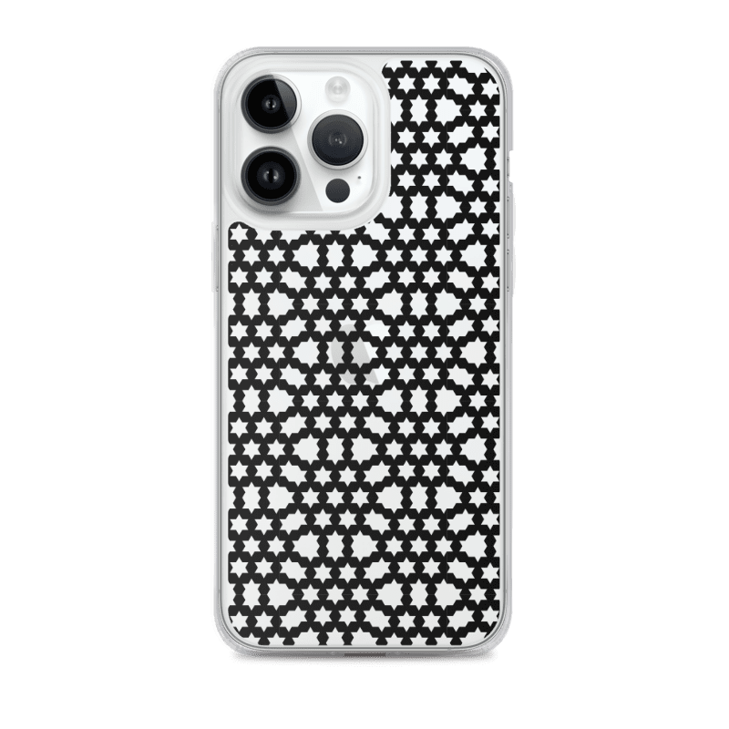

## Extras

I'm working on applying all this to cellular automata — grids of cells that live and die by simple rules, like Conway's famous Game of Life. A demo is already live: `mrlypy/mrlydemos/game.py`. To follow along, find us on Instagram or YouTube (@mrlyprod).

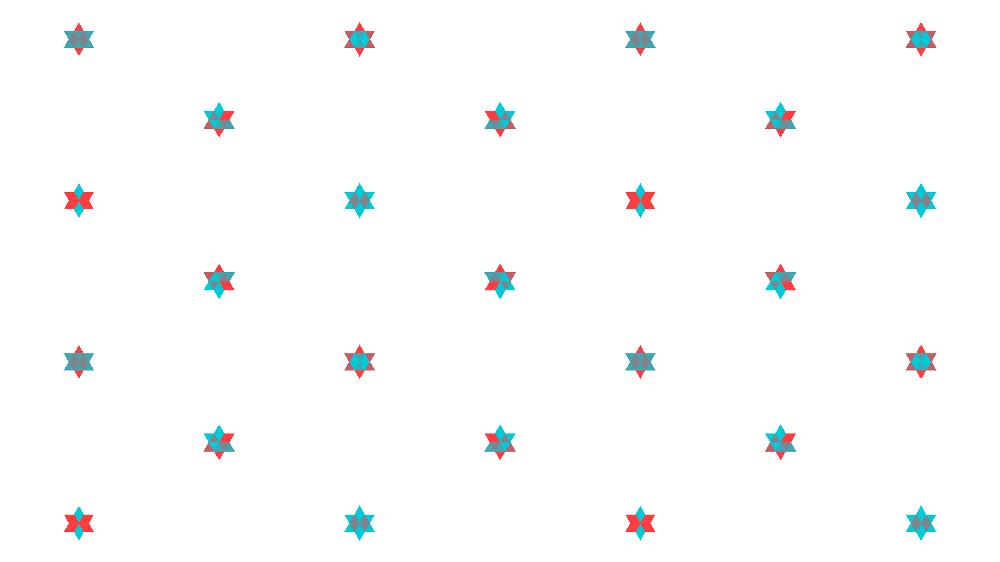


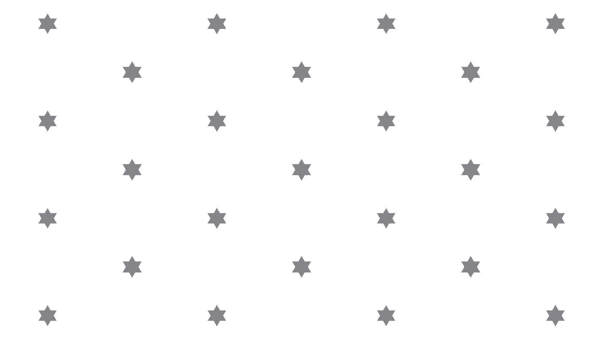

## The End

Thank you for reading. I invite you to join me on my quest to discover...

*The Wonderful World of MrlyMath*

```txt
--------------------------1111111111111111111111111111111111111111111111111111111--------------------------
-------------------------111101111111111101111111111101111111111101111111111101111-------------------------
------------------------11100000111111100000111111100000111111100000111111100000111------------------------
-----------------------1111000001110111000001111111000001111111000001110111000001111-----------------------
----------------------111111101111000111101111111111101111111111101111000111101111111----------------------
---------------------11111111111100000111111111111111111111111111111100000111111111111---------------------
--------------------1111111000000000000000001111111111111111111000000000000000001111111--------------------
-------------------111101111000000000000000111101111111111101111000000000000000111101111-------------------
------------------11100000111000000000000011100000111111100000111000000000000011100000111------------------
-----------------1111000001110000000000000111000001110111000001110000000000000111000001111-----------------
----------------111111101111000000000000000111101111000111101111000000000000000111101111111----------------
---------------11111111111100000000000000000111111100000111111100000000000000000111111111111---------------
--------------1111111111111111111000001111111111110000000111111111111000001111111111111111111--------------
-------------111101111111111101111000111101111111000000000111111101111000111101111111111101111-------------
------------11100000111111100000111011100000111100000000000111100000111011100000111111100000111------------
-----------1111000001111111000001111111000001110000000000000111000001111111000001111111000001111-----------
----------111111101111111111101111111111101111000000000000000111101111111111101111111111101111111----------
---------11111111111111111111111111111111111100000000000000000111111111111111111111111111111111111---------
--------1111111111111111111000000000000000000000000000000000000000000000000000001111111111111111111--------
-------111101111111111101111000000000000000000000000000000000000000000000000000111101111111111101111-------
------11100000111111100000111000000000000000000000000000000000000000000000000011100000111111100000111------
-----1111000001110111000001111000000000000000000000000000000000000000000000001111000001110111000001111-----
----111111101111000111101111111000000000000000000000000000000000000000000000111111101111000111101111111----
---11111111111100000111111111111000000000000000000000000000000000000000000011111111111100000111111111111---
--1111111000000000000000001111111000000000000000000000000000000000000000001111111000000000000000001111111--
-111101111000000000000000111101111000000000000000000000000000000000000000111101111000000000000000111101111-
11100000111000000000000011100000111000000000000000000000000000000000000011100000111000000000000011100000111
11100000111000000000000011100000111000000000000000000000000000000000000011100000111000000000000011100000111
-111101111000000000000000111101111000000000000000000000000000000000000000111101111000000000000000111101111-
--1111111000000000000000001111111000000000000000000000000000000000000000001111111000000000000000001111111--
---11111111111100000111111111111000000000000000000000000000000000000000000011111111111100000111111111111---
----111111101111000111101111111000000000000000000000000000000000000000000000111111101111000111101111111----
-----1111000001110111000001111000000000000000000000000000000000000000000000001111000001110111000001111-----
------11100000111111100000111000000000000000000000000000000000000000000000000011100000111111100000111------
-------111101111111111101111000000000000000000000000000000000000000000000000000111101111111111101111-------
--------1111111111111111111000000000000000000000000000000000000000000000000000001111111111111111111--------
---------11111111111111111111111111111111111100000000000000000111111111111111111111111111111111111---------
----------111111101111111111101111111111101111000000000000000111101111111111101111111111101111111----------
-----------1111000001111111000001111111000001110000000000000111000001111111000001111111000001111-----------
------------11100000111111100000111011100000111100000000000111100000111011100000111111100000111------------
-------------111101111111111101111000111101111111000000000111111101111000111101111111111101111-------------
--------------1111111111111111111000001111111111110000000111111111111000001111111111111111111--------------
---------------11111111111100000000000000000111111100000111111100000000000000000111111111111---------------
----------------111111101111000000000000000111101111000111101111000000000000000111101111111----------------
-----------------1111000001110000000000000111000001110111000001110000000000000111000001111-----------------
------------------11100000111000000000000011100000111111100000111000000000000011100000111------------------
-------------------111101111000000000000000111101111111111101111000000000000000111101111-------------------
--------------------1111111000000000000000001111111111111111111000000000000000001111111--------------------
---------------------11111111111100000111111111111111111111111111111100000111111111111---------------------
----------------------111111101111000111101111111111101111111111101111000111101111111----------------------
-----------------------1111000001110111000001111111000001111111000001110111000001111-----------------------
------------------------11100000111111100000111111100000111111100000111111100000111------------------------
-------------------------111101111111111101111111111101111111111101111111111101111-------------------------
--------------------------1111111111111111111111111111111111111111111111111111111--------------------------
```