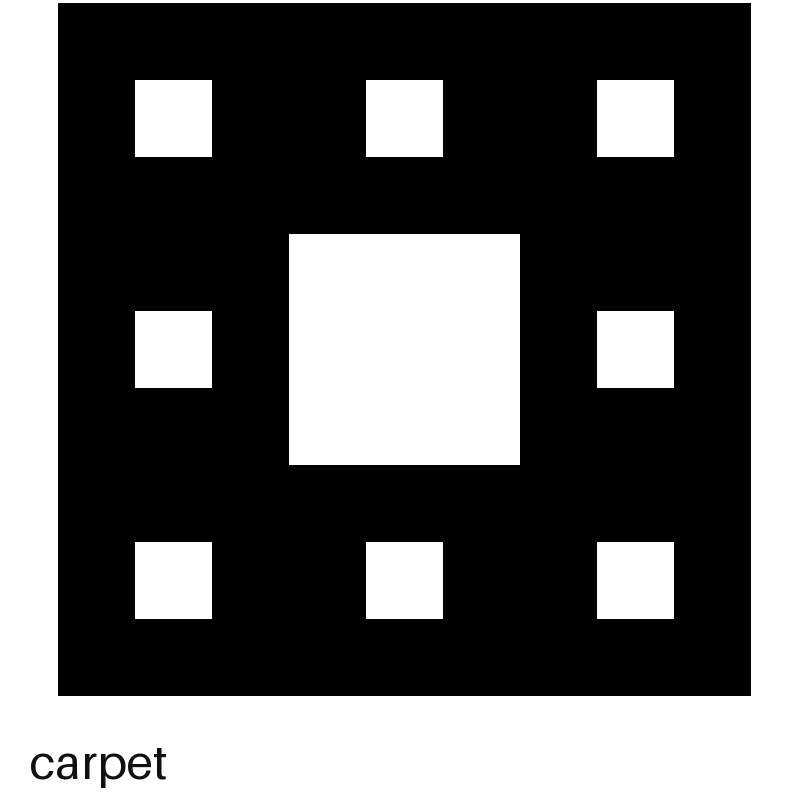
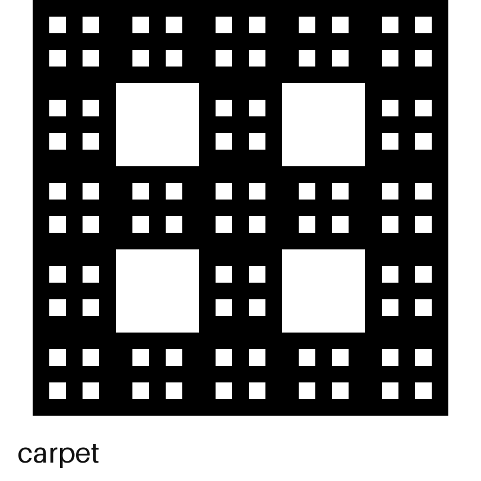
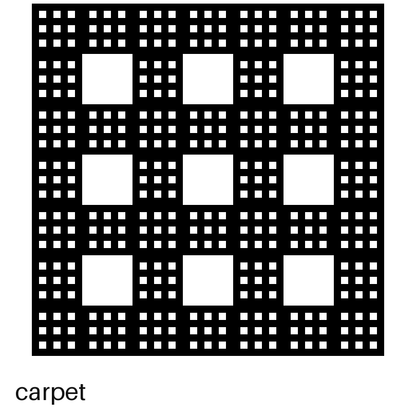
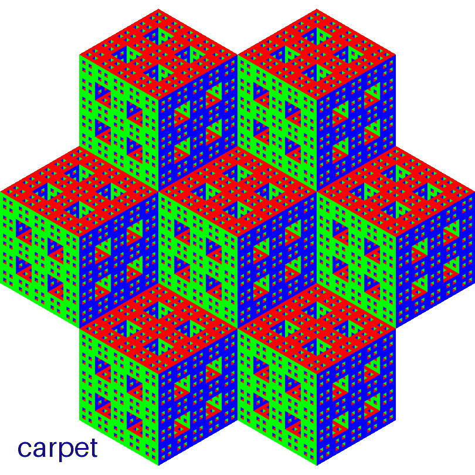
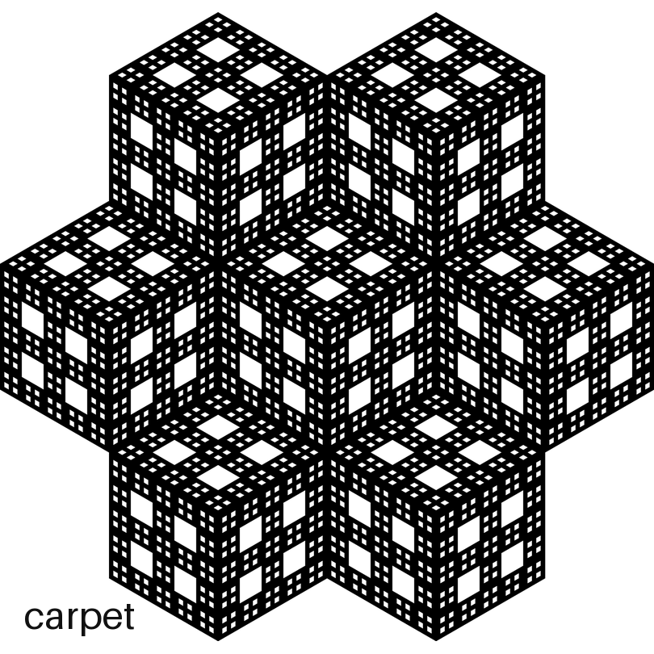
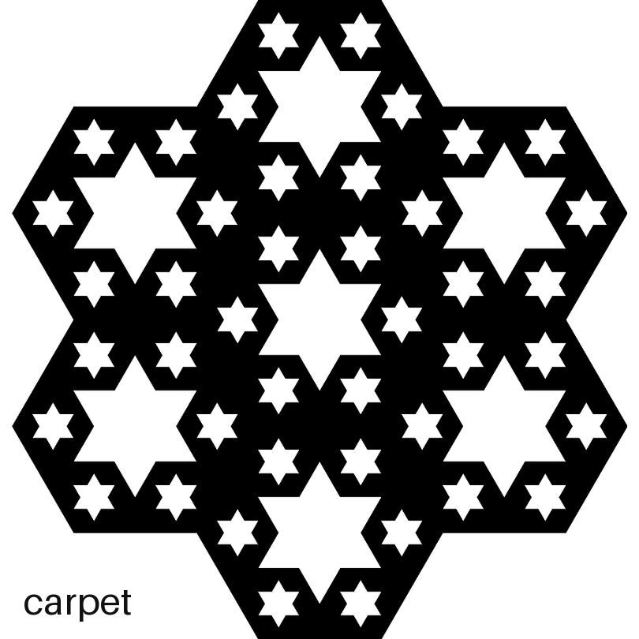
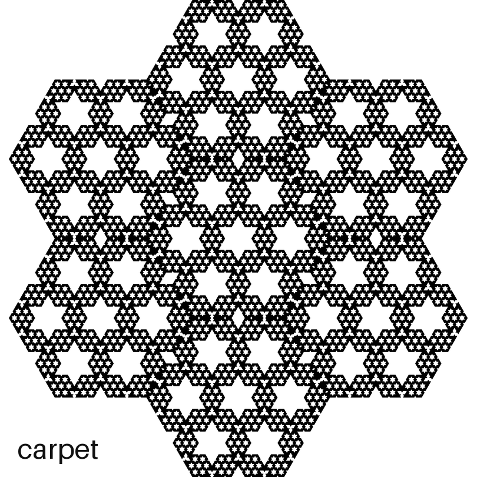

# SHOWCASE

Every family draws four ways:

- **flat** — the rule in 2D: the pattern before a third axis exists
- **iso** — the whole 3D sponge, seen corner-on (the fancy word is *isometric*)
- **pro** — the three faces the sponge shows you
- **cut** — the diagonal slice through the middle

and each view animates the four families, one frame each, labeled in the corner:

- **carpet** — keep a cell when at most one axis is odd (the sponges above)
- **net** — keep when all axes are odd, or all but one
- **tree** — pick one axis to run free; keep when every other axis is even
- **void** — keep when every axis has the same parity

All at level 2 — the three sponge views tiled in rings around the center, the flat view left bare. Views down the side, numbers across the top. Read a column top to bottom and you watch one number grow up — flat pattern → sponge → faces → snowflake. (And peek at the flat carpet in the 5 column: it's the MrlyProd logo, one level deeper.)

|  | 3 | 5 | 7 |
| --- | --- | --- | --- |
| **flat** |  |  |  |
| **iso** |  |  |  |
| **pro** |  |  |  |
| **cut** |  |  |  |

Run `uv run some26/showcase.py` for the console, add `all` to draw every cell above, or `cut 5` for just one.