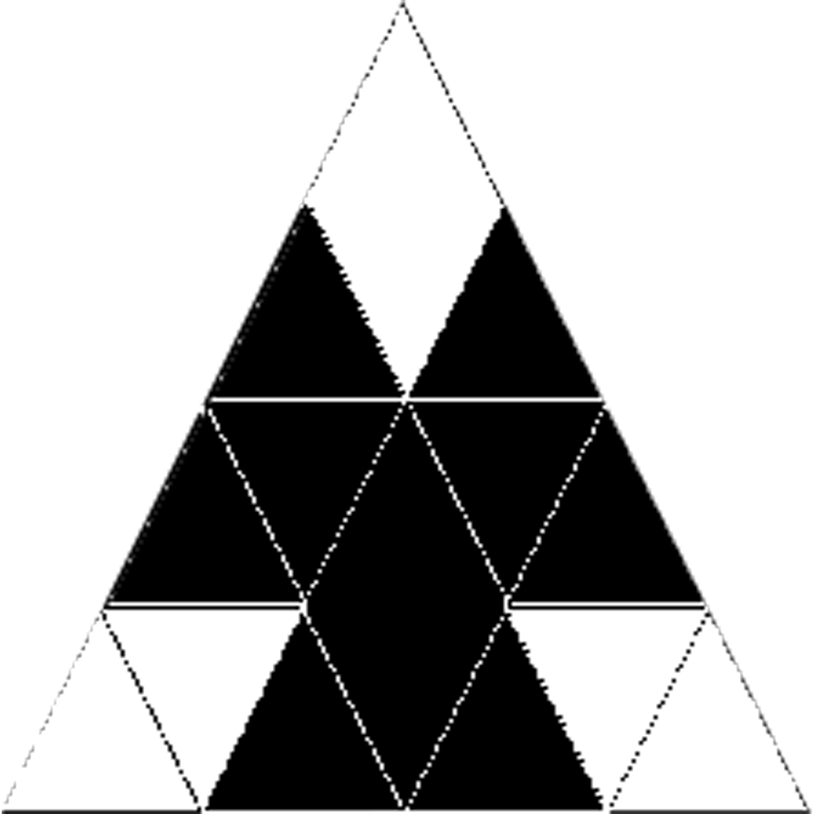
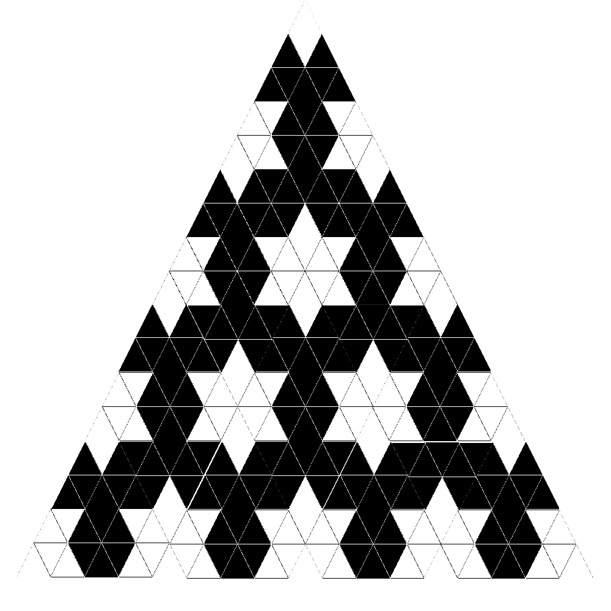

# The Solution

Around March 2025, all that staring at 1s and 0s paid off: I found a very pretty algorithm. It only works for level 1, but it works: a secret four-word alphabet, cycling in a loop of eight. I wrote it myself, and I'm quite proud of it.

How does it work? Here's the path that led me to it. First: the snowflake divides by six — spin it 60° and it lands back on itself — so forget the hexagon and stare at a single 60° slice. Second: inside that slice, the pattern grows outward in a way that's almost embarrassingly regular. Third: the regularity has a *unit*. One puzzle piece, four rows tall, tessellates the entire slice:



Those four rows are a secret four-word alphabet — `a = 0`, `b = 101`, `c = 11111`, `d = 0011100` — and the algorithm is just the tessellation in disguise. The rows cycle through the alphabet in a loop of eight: a, b, c, d, d, c, b, a, over and over. Each row starts from its center word and grows outward, wrapping itself in its partner word, then in its own, alternating until it's long enough (then trim the edges to fit) — the puzzle piece being laid down again and again: center, left, right, further out. Build the bottom half, copy and flip for the top. One last twist: the exact center of the snowflake alternates fill, void, fill, void as the number climbs, so when the number is one more than a multiple of 4, every bit flips at the end.

Here's the tile at work — one 60° slice of the number-9 snowflake, fully tessellated:



Why does one four-row tile tessellate every odd snowflake? That part I still can't prove — it's on the [open questions](README.md#open-questions) list.

The heart of [solution.py](solution.py):

```python
FLIP = str.maketrans("01", "10")

def mrlygram(number: int):
    a = "0"
    b = "101"
    c = "11111"
    d = "0011100"
    rows = number
    bottom = []
    cursor = 0
    for index in range(rows):
        cursor = cursor % 8 + 1
        match cursor:
            case 1 | 8:
                center = a
                alternate = d
            case 2 | 7:
                center = b
                alternate = c
            case 3 | 6:
                center = c
                alternate = b
            case 4 | 5:
                center = d
                alternate = a
        binary = center
        target = 4 * number - 1 - (2 * index)
        while len(binary) < target:
            binary = alternate + binary + alternate
            binary = center + binary + center
        while len(binary) != target:
            binary = binary[1:-1]
        bottom.append(binary)
    top = bottom.copy()
    top.reverse()
    binary = top + bottom
    if number % 4 == 1:
        binary = [row.translate(FLIP) for row in binary]
    return binary
```

## From bits to snowflake

The challenge said to draw it, too. The rest of [solution.py](solution.py) is the original pipeline, three small steps, still no libraries — just Python:

1. **Coordinates** — pad every row with `-` into a full block, and tag each cell fill, void or grid.
2. **Points** — walk the cells alternating point-up, point-down; each triangle is three vertices, and each column steps half a cell sideways.
3. **SVG** — write every fill and void triangle as a polygon, scale the rows by √3/2 so the triangles come out equilateral, and the snowflake opens in your browser.

```bash
python3 some26/solution.py 9    # prints the blob, writes mrlygram-9.svg
```

A rougher ancestor of this pipeline — PIL polygons instead of SVG — drew the very stills cycling in [the challenge](README.md#the-challenge) gif.

Is this also what you found? I'd love to know! Send your solution to the email on [my GitHub profile](https://github.com/carlomitchener).
